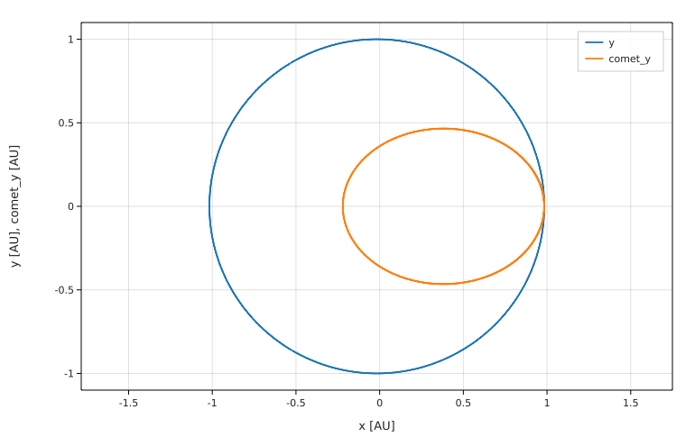
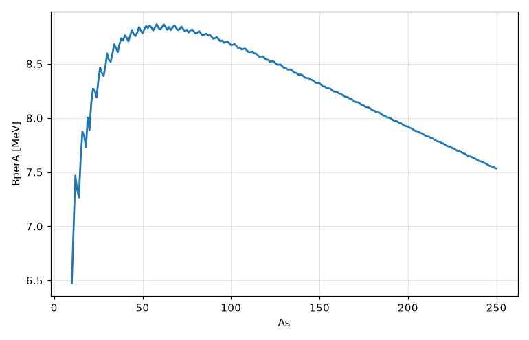
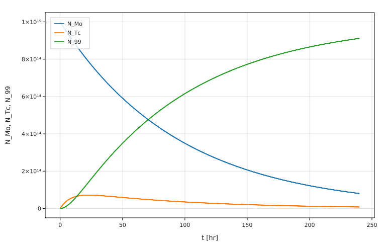
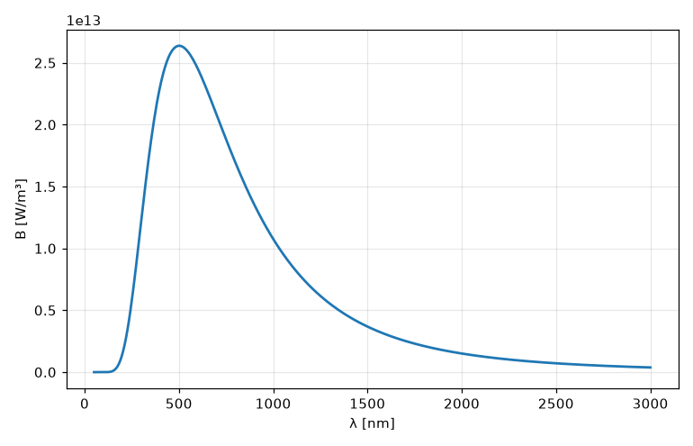

# Fermium

**Physics code that reads like physics on paper. The compiler understands units and calculus, and the code runs at native speed.**

```fermium
L = 1.20 m
T = 2.21 s
g = 4π² L / T²
print g                 # 9.70 m/s²
print g in ft/s²        # 31.8 ft/s²
```

Add `y = L + T` as line 6 of that file (a length plus a time, by mistake), and the program doesn't run at all. The compiler stops it first:

```
pendulum.fm, line 6: can't add length [m] to time [s]
    y = L + T
        ^^^^^
  hint: both sides of + and - must have the same units
```

Fermium is a small programming language for physicists.
- **Units are part of the language.** The compiler checks them *before the program runs*, and they cost nothing at run time: they are erased before code generation.
- **Calculus is built in:** `x'`, `d/dt`, `∫ … dx from a to b`, and `solve m x'' = -k x with …`.
- **Programs compile to native code** through LLVM (via llvmlite).
- **Errors are one line in physics terms**, with a caret and a hint.
- **Plain ASCII works too.** You can type `pi` or `π`, `sqrt` or `√`, `x^2` or `x²`. `fermium fmt --pretty` / `--ascii` converts between the two.

> Status: a first version built in one night. See [PROGRESS.md](PROGRESS.md) for what works, what's partial, and the known issues.

## Install

```
git clone <this repository>
cd fermium
python3 -m pip install -e ".[full]"   # needs Python 3.10+; llvmlite, numpy, and scipy/sympy/matplotlib for fit, symbolic integrals and plot
fermium doctor                   # checks everything and explains fixes
```

New to programming? Start with the **[Fermium Bootcamp](bootcamp/README.md)**. Lesson 0 walks through the install on a Mac, step by step.

## A 30-second tour

```fermium
# Mass on a spring
k = 50 N/m
m = 0.5 kg
ω = √(k/m)
print ω in rad/s                      # 10 rad/s

A = 10 cm                             # cm, not 0.1 m: here m is also the mass (Fermium would warn)
x(t) = A cos(ω t)
v = d/dt x
print v                               # v(t) = -A ω sin(ω t)   [m/s, for t in s]

F(x) = k x
W = ∫ F(x) dx from 0 cm to 20 cm
print W                               # 1 J

b = 0.2 kg/s
solve m x'' = -k x - b x'
  with x(0) = 10 cm, x'(0) = 0 m/s
  for t from 0 s to 5 s
print x(5 s)                          # 3.52006 cm
```

Also:
- `data = load "pendulum.csv"` reads a CSV whose headers carry units, like `L [m], T [s]`.
- `fit T = 2π √(L / g) to data` fits the model and reports g in m/s². The left side may be a formula of a column: `fit T² = k L to data`.
- `plot x vs t` saves a PNG with labelled axes.
- Vectors: `<3, 4> m/s`, `|v|`, `v.x`, `a · b`, `a × b`. ODEs can have vector unknowns: `solve r'' = -G M r / |r|³ with …`.
- Leibniz notation: `dx/dt` works for functions and in `solve`.
- `fermium build prog.fm` makes a standalone executable (needs a C compiler). `load`, `fit` and `plot` work in it too; plots are written as SVG, and data files are read from the folder you run the program in.

## Gallery

Every example program in [`examples/`](examples) is commented and tested. Here are some of their plots.

**Kepler orbits** ([04_kepler_orbit.fm](examples/04_kepler_orbit.fm)):
```
solve x'' = -GM x / (x² + y²)^(3/2),
      y'' = -GM y / (x² + y²)^(3/2)
  with x(0) = r_peri, y(0) = 0 m,
       x'(0) = 0 m/s, y'(0) = v_peri
  for t from 0 s to 1 yr
plot y in AU vs x in AU, comet_y in AU vs comet_x in AU to "gallery/kepler_orbit.png"
```


**Binding energy per nucleon**, from the semi-empirical mass formula ([09_binding_energy.fm](examples/09_binding_energy.fm)):
```
B(Z, A) = a_V A - a_S A^(2/3) - a_C Z (Z - 1) / A^(1/3) - a_A (A - 2Z)² / A + pairing(Z, A)
...
plot BperA in MeV vs As to "gallery/binding_energy.png"
```


**The Bateman decay chain Mo-99 → Tc-99m → Tc-99** ([08_bateman_chain.fm](examples/08_bateman_chain.fm)):
```
solve N_Mo' = -λ_Mo N_Mo,
      N_Tc' = λ_Mo N_Mo - λ_Tc N_Tc,
      N_99' = λ_Tc N_Tc
  with N_Mo(0) = N0, N_Tc(0) = 0, N_99(0) = 0
  for t from 0 hr to 240 hr
plot N_Mo vs t, N_Tc vs t, N_99 vs t to "gallery/bateman_chain.png"
```


**Planck's law for the Sun** ([06_blackbody.fm](examples/06_blackbody.fm)):
```
flux = π * ∫ B(λ) dλ from 0 nm to ∞        # equals σT⁴ to 10 digits
plot B(λ) vs λ from 50 nm to 3000 nm to "gallery/blackbody.png"
```


## Speed

Measured on the same machine, median of repeated runs. The full table, methods and caveats are in [benchmarks/RESULTS.md](benchmarks/RESULTS.md).

| Benchmark | Fermium (compute) | Julia (compute) | Pure Python |
|---|---|---|---|
| N-body, 1M steps | 1.28× Julia | 1× | ~56× Julia |
| Damped spring, RK4, 1M steps (Fermium also stores the whole trajectory) | 1.82× Julia | 1× | ~21× Julia |
| Damped spring, adaptive RK45, same accuracy | ~1.1× Julia (spot check; next full run updates RESULTS.md) | 1× | ~21× Julia |
| Blackbody integrals | 0.91× Julia (faster) | 1× | ~23× Julia |
| Loop with units | 1.09× Julia | 1× | ~80× Julia |

Counting startup and compilation, the Fermium benchmark programs finish sooner than Julia's (0.1–0.33 s against 0.9–2.8 s for the whole process), because Julia spends that time JIT-compiling. A program that computes one number takes 0.11 s in Fermium and 0.25 s in Julia (the `startup` row in RESULTS.md).

## Gauntlet

Textbook problems from ten fields of physics, solved in Fermium and checked against closed forms or SciPy ([gauntlet/](gauntlet/README.md)). Every rough edge they hit is logged in [gauntlet/FRICTION.md](gauntlet/FRICTION.md) and fixed in the language where possible.

<!-- gauntlet-table -->
| Topic | Pass 1 | Pass 2 |
|---|---|---|
| mechanics | 3 | 3 |
| oscillations | 3 | 3 |
| gravitation | 3 | 3 |
| thermodynamics | 3 | 3 |
| electromagnetism | 3 | 3 |
| optics waves | 3 | 3 |
| special relativity | 3 | 3 |
| quantum | 3 | 3 |
| nuclear | 3 | 3 |
| astrophysics | 4 | 3 |
| **total** | **31** | **30** |

Friction items logged: 59; fixed in the language: 46.
<!-- /gauntlet-table -->

## Browser playground

`web/` is a static site that runs Fermium in the browser with [Pyodide](https://pyodide.org): an editor with `\name` + Tab completion, Run (Ctrl+Enter / Cmd+Enter), errors in the usual one-line form, plots, and a menu with every code block of the bootcamp lessons and every program in `examples/`. Nothing is sent to a server. It uses the reference interpreter (`fermium run --interp`), because llvmlite doesn't exist in the browser, so it is slower than the desktop compiler; its output matches `fermium run`.

```
python3 web/build.py                  # examples, symbols and a wheel of fermium -> web/gen/
python3 -m http.server -d web 8000    # then open http://localhost:8000/
```

Pyodide loads from the jsdelivr CDN. `python3 web/build.py --local-pyodide` downloads it (about 45 MB) into `web/pyodide/`, and the page then works offline. `web/gen/` and `web/pyodide/` are build outputs and are not committed.

## Documentation
- [Language reference](docs/reference.md)
- [Rosetta page](docs/rosetta.md): the same programs in Fermium, Julia and Python
- [Design decisions](DECISIONS.md): why the language is the way it is
- [Bootcamp](bootcamp/README.md): a course for people who have never programmed
- [Cheat sheet](bootcamp/CHEATSHEET.md)
- [VS Code extension](editors/vscode/README.md)

## Development

```
./check.sh           # lint + all tests (including every ```fermium code block and bootcamp output box) + all examples
python3 benchmarks/run.py
```

Project layout:
- `fermium/`: the compiler.
  - `lexer.py`, `parser.py`, `checker.py` (units and types), `calculus.py`, `solve.py`
  - `codegen_llvm.py` (the LLVM backend and numeric kernels)
  - `runtime/` (printing, plots, data, fits)
  - `repl.py`, `fmt.py`, `cli.py`
  - `interp.py` (the reference interpreter: no LLVM, also used by the browser playground)
- `tests/`: pytest suites.
