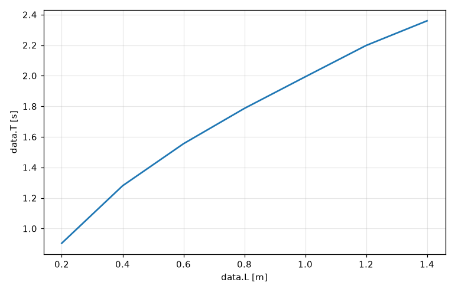
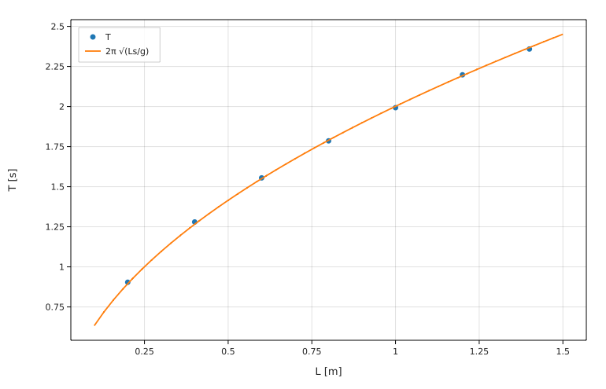
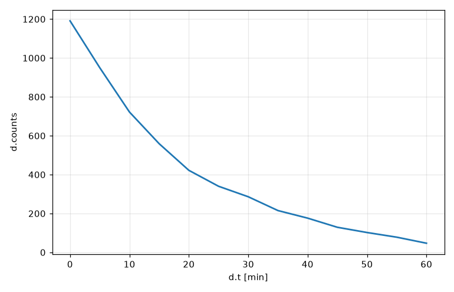

# Lesson 6 — Loading lab data & plotting

In a real lab you write your measurements in a spreadsheet, not in your program. In this lesson you'll load a data file, analyse it, fit a model to it, and draw graphs. This is the lesson where programming starts saving you real time.

## CSV files

The most common format for data is **CSV**, "comma-separated values". It's a plain text file where each line is a row and commas separate the columns. Here's `data/pendulum.csv` from this course folder: a pendulum's period measured for seven different lengths.

```
L [m], T [s]
0.20, 0.904
0.40, 1.280
0.60, 1.555
0.80, 1.786
1.00, 1.993
1.20, 2.198
1.40, 2.359
```

The first line is the **header**: the name of each column, with its **unit in square brackets**. That's how Fermium knows that `L` is in metres and `T` in seconds. A column without units (like a count) just has a name: `counts`.

> **Making your own CSV:** in Numbers, choose **File → Export To → CSV…**; in Excel, **File → Save As…** and pick "CSV UTF-8". Then open the file in VS Code and edit the header line so it looks like `L [m], T [s]`. You can also type a CSV directly in VS Code.

## Loading the data

```fermium
data = load "data/pendulum.csv"
print data
print data.L
print data.T
```

<!-- output -->
```
data from data/pendulum.csv: columns L [m], T [s]
[0.2, 0.4, 0.6, 0.8, 1, 1.2, 1.4] m
[0.904, 1.28, 1.555, 1.786, 1.993, 2.198, 2.359] s
```

`load` reads the file. The path `"data/pendulum.csv"` is relative to the folder your program is in, so save your program in the `bootcamp` folder (next to the `data` folder), or change the path.

Each column is a list with units: `data.L` and `data.T`. Everything from Lesson 5 works on them.

## Analysing: g from every measurement

For each row, g = 4π²L/T². List arithmetic does all seven rows at once:

```fermium
data = load "data/pendulum.csv"
g = 4 pi^2 data.L / data.T^2
print g
print "mean g =", mean(g), "+/-", std(g) / sqrt(len(g))
```

<!-- output -->
```
[9.66168, 9.63829, 9.79603, 9.90118, 9.93906, 9.80586, 9.93189] m/s²
mean g = 9.81057 m/s² +/- 0.04668 m/s²
```

(We printed the text `"+/-"` rather than the symbol `±`, which Fermium reserves for a future feature.)

## Plotting

A graph shows you things a table can't. One line:

```fermium
data = load "data/pendulum.csv"
plot data.T vs data.L to "pendulum_data.png"
```

<!-- output -->
```
plot saved to pendulum_data.png
```

`plot Y vs X` puts Y on the vertical axis and X on the horizontal axis. `to "pendulum_data.png"` chooses the file name (without it, Fermium makes up a name, here `data_T_vs_data_L.png`). The picture is saved in the same folder as your program. Open it by double-clicking it in Finder, or from the Terminal with:

```
open pendulum_data.png
```

The result, with axes labelled with units automatically:



Columns loaded from a file are drawn as dots, because they are separate measurements. Lists you calculate yourself and formulas are drawn as smooth lines.

## Fitting a model

Theory says T = 2π√(L/g). Rather than computing g row by row, let's find the single value of g that makes the curve go through the data as well as possible. This is called **fitting** (the *least-squares* method), and in Fermium it's one line:

```fermium
data = load "data/pendulum.csv"
fit T = 2 pi sqrt(L / g) to data
print "so g is", g
```

<!-- output -->
```
fit T = 2π √(L/g)   (7 data points from data/pendulum.csv)
  g = 9.856 m/s²   (standard error 0.038 m/s²)
  rms residual = 0.00850 s
so g is 9.86 m/s²
```

How does Fermium know what to fit? `T` and `L` are column names in the data; `pi` is a constant; so `g`, the only unknown name, is the **parameter** to find. Fermium also worked out that g must be in m/s² from the units of the columns. It reports:

- the best value of g, with a **standard error** (the uncertainty of the fit),
- the **rms residual**: how far the data points are from the curve, on average. Here it's under 0.01 s, consistent with timing by hand.

After the fit, `g` is an ordinary variable you can use.

### Fitting a straight line: T² against L

In the lab you may have learned a different trick: square both sides of T = 2π√(L/g) to get T² = (4π²/g) L. Then T² against L is a **straight line** through the origin with slope k = 4π²/g. You can fit exactly that. The left side of a fit can be a formula made from a column, like `T^2`:

```fermium
data = load "data/pendulum.csv"
fit T^2 = k L to data
print "slope k =", k
print "so g is", 4 pi^2 / k
```

<!-- output -->
```
fit T² = k L   (7 data points from data/pendulum.csv)
  k = 3.997 s²/m   (standard error 0.012 s²/m)
  rms residual = 0.0271 s²
slope k = 4.00 s²/m
so g is 9.88 m/s²
```

Fermium worked out that the slope `k` must be in s²/m. The g from this fit (9.88 m/s²) is slightly different from the one above (9.86 m/s²), because squaring T changes how much each point counts in the fit. The two answers agree within the fit's standard error of 0.04 m/s², so both are fine.

### Showing the fit on the graph

Plot several things on one graph by separating them with commas. Here are the data and the fitted curve:

```fermium
data = load "data/pendulum.csv"
fit T = 2 pi sqrt(L / g) to data
Ls = linspace(0.1 m, 1.5 m, 50)
plot data.T vs data.L, 2 pi sqrt(Ls / g) vs Ls to "pendulum_fit.png"
```

<!-- output -->
```
fit T = 2π √(L/g)   (7 data points from data/pendulum.csv)
  g = 9.856 m/s²   (standard error 0.038 m/s²)
  rms residual = 0.00850 s
plot saved to pendulum_fit.png
```



### Plotting a formula

To plot a formula, give the range of the horizontal axis:

```fermium
T_of_L(L) = 2 pi sqrt(L / 9.81 m/s^2)
plot T_of_L(L) vs L from 0 m to 2 m to "pendulum_theory.png"
```

<!-- output -->
```
plot saved to pendulum_theory.png
```

## Example 2: radioactive decay

`data/decay.csv` holds counts from a radioactive source, measured every 5 minutes:

```
t [min], counts
0, 1191
5, 950
10, 722
...
```

The model is N(t) = N₀ e^(−t/τ), with two unknowns, N₀ and τ. For a model like this it helps to give **starting guesses** with `with`, so the fit knows roughly where to look:

```fermium
d = load "data/decay.csv"
fit counts = N0 exp(-t / tau) to d with N0 = 1000, tau = 10 min
print "half-life:", tau ln(2) in min
plot d.counts vs d.t to "decay.png"
```

<!-- output -->
```
fit counts = N0 exp(-t/τ)   (13 data points from data/decay.csv)
  N0 = 1195.6   (standard error 9.4)
  τ = 20.10 min   (standard error 0.26 min)
  rms residual = 10.8
half-life: 13.9 min
plot saved to decay.png
```



The half-life is τ ln 2 ≈ 14 minutes. (Don't be misled by the name `ln`: it's the natural logarithm, and `ln(2)` ≈ 0.693.)

## Summary

- CSV header: `name [unit], name [unit]`. Load with `data = load "file.csv"`; columns are `data.name`.
- Columns are lists: `mean(data.T)`, `4 pi^2 data.L / data.T^2`.
- `plot Y vs X to "file.png"` saves a graph. Several series: `plot A vs X, B vs X`. Formulas: `plot f(x) vs x from a to b`.
- `fit model to data` finds unknown parameters, with units and standard errors. Add `with a = ..., b = ...` for starting guesses. The left side can be a formula of a column: `fit T^2 = k L to data`.

## Exercises

1. **Your own data.** Make a file `data/spring.csv` with this header and data (the extension of a spring for different hanging masses): `M [kg], x [cm]` with rows `0.1, 1.9`, `0.2, 4.1`, `0.3, 5.9`, `0.4, 8.2`, `0.5, 9.9`. Load it and print both columns. (A finished copy is already in the `data` folder, in case you get stuck.)
2. **Spring constant.** Hooke's law says M g = k x. Fit `x = M * 9.81 m/s^2 / k` to your spring data to find k in N/m. Plot x against M.
3. **Pendulum statistics.** Using `data/pendulum.csv`, find the row where the computed g is furthest from 9.81 m/s². (Hint: `abs(g - 9.81 m/s^2)` is a list; use `max` and a loop.)
4. **Decay rate.** Using `data/decay.csv`, compute the decay constant λ = 1/τ in s⁻¹ and in min⁻¹, and the activity at t = 0 (A = λN₀) in decays per minute.
5. **Plot a model.** Plot the decay model N(t) = 1200 exp(−t / 20 min) for t from 0 min to 60 min, together with the data. (Hint: make a list of times with `linspace`.)

Solutions: [solutions/lesson06.md](solutions/lesson06.md)

**Next:** [Lesson 7 — Derivatives](lesson07_derivatives.md)
