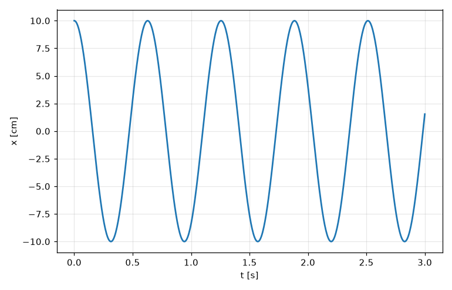
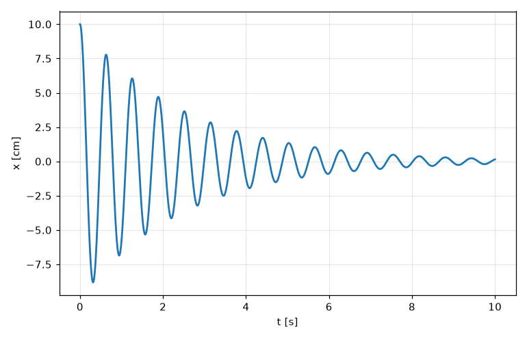
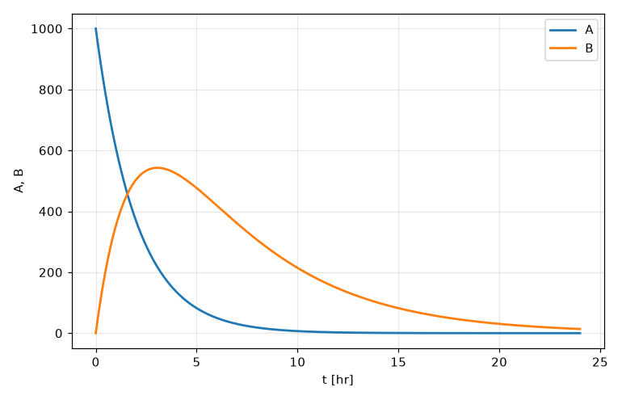
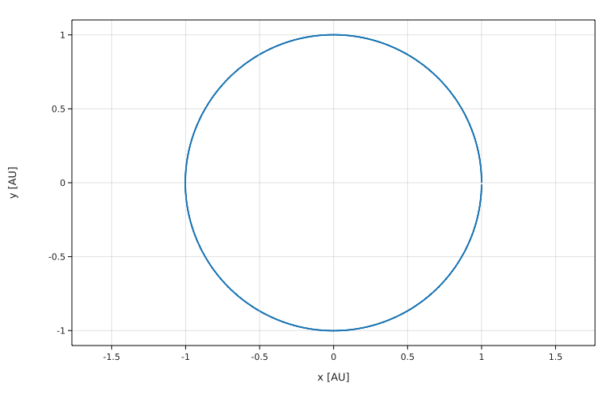

# Lesson 9 — Differential equations: springs, decay, orbits

Most laws of physics are **differential equations**: they tell you how something *changes*, not what it is. Newton's second law, F = ma, says how velocity changes. The decay law says how the number of nuclei changes. Solving them gives you the motion.

In Lesson 4 you solved one by hand with a loop (the thrown ball). That works, but it takes care to get accurate answers. Fermium has a built-in solver, `solve`, that does the stepping for you, accurately and fast.

## Radioactive decay

The number of undecayed nuclei N obeys dN/dt = −N/τ, where τ is the mean lifetime. With τ = 5 s and 1000 nuclei at the start:

```fermium
tau = 5 s
solve N' = -N / tau
  with N(0) = 1000
  for t from 0 s to 20 s
print "after 5 s: ", N(5 s)
print "after 10 s:", N(10 s)
print "exact:     ", 1000 exp(-10 s / tau)
```

<!-- output -->
```
after 5 s:  367.879
after 10 s: 135.335
exact:      135.335
```

A `solve` has three parts:

1. **The equation**, with primes for derivatives: `N' = -N / tau`. (You can also write it the textbook way, `dN/dt = -N / tau`, or `d/dt N = -N / tau`.)
2. **`with`**: the **initial conditions**, the values at the start. `N(0) = 1000` means "N is 1000 at t = 0". (You can write `N(0)` even when t is in seconds.)
3. **`for`**: the independent variable (here `t`) and the range to solve over.

The indentation of the `with` and `for` lines is up to you; you can also write everything on one line.

After `solve`, `N` is a function you can call at any time within the range: `N(5 s)`, `N(12.3 s)`. Fermium checked that both sides of the equation have the same units (a number per second) before solving.

## A mass on a spring

Newton's law for a mass on a spring is m x″ = −kx:

```fermium
k = 50 N/m
mass = 0.5 kg
solve mass x'' = -k x
  with x(0) = 10 cm, x'(0) = 0 m/s
  for t from 0 s to 3 s
print "x at 0.5 s:", x(0.5 s)
print "exact:     ", 10 cm * cos(sqrt(k / mass) * 0.5 s)
plot x vs t to "spring.png"
```

<!-- output -->
```
x at 0.5 s: 2.8 cm
exact:      2.8 cm
plot saved to spring.png
```



For a second derivative, write `x''` (or `d²/dt² x`; the form `d²x/dt²` isn't understood yet). A second-order equation (with x″) needs **two** initial conditions: the starting position `x(0)` and the starting velocity `x'(0)`. If you forget one, Fermium tells you which is missing.

You don't need to rearrange the equation to "x″ = …" yourself. Fermium does that: `mass x'' = -k x` is fine. (We called the mass `mass` rather than `m`, to avoid the metre gotcha from Lesson 2.)

### Adding friction: the damped oscillator

Real springs lose energy. Add a friction force −b x′:

```fermium
k = 50 N/m
mass = 0.5 kg
b = 0.4 kg/s
solve mass x'' = -k x - b x'
  with x(0) = 10 cm, x'(0) = 0 m/s
  for t from 0 s to 10 s
print "x at 10 s:", x(10 s)
print "velocity at 1 s:", x'(1 s)
plot x vs t to "damped.png"
```

<!-- output -->
```
x at 10 s: 0.145813 cm
velocity at 1 s: 0.360444 m/s
plot saved to damped.png
```



That's a problem that's messy by hand but just one extra term here. You can use `x'(t)` (velocity) and `x''(t)` (acceleration) after solving too.

### Checking energy conservation

A good habit: check a conserved quantity. For the undamped spring, E = ½mv² + ½kx² should stay constant:

```fermium
k = 50 N/m
mass = 0.5 kg
solve mass x'' = -k x
  with x(0) = 10 cm, x'(0) = 0 m/s
  for t from 0 s to 100 s
E(t) = ½ mass x'(t)^2 + ½ k x(t)^2
print "energy at start:", E(0 s) to 9 digits
print "energy at 100 s:", E(100 s) to 9 digits
```

<!-- output -->
```
energy at start: 0.250000000 J
energy at 100 s: 0.249999940 J
```

The energy stays the same to 7 digits after more than a hundred oscillations: the solver is accurate.

## A real pendulum

The textbook pendulum formula T = 2π√(L/g) is only right for small swings. The real equation is θ″ = −(g/L) sin θ, which has no simple solution. With `solve`, it doesn't matter:

```fermium
g = 9.81 m/s^2
L = 1 m
solve theta'' = -(g / L) sin(theta)
  with theta(0) = 90 deg, theta'(0) = 0 rad/s
  for t from 0 s to 5 s
print "angle after 1 s:", theta(1 s) in deg
plot theta in deg vs t to "pendulum_big.png"
```

<!-- output -->
```
angle after 1 s: -80.5021°
plot saved to pendulum_big.png
```

`plot theta in deg vs t` shows the angle in degrees on the graph. Try exercise 2 to see how the period depends on the amplitude.

## Several equations at once: a decay chain

In a decay chain, A decays into B, which decays into C. Two equations, one for each:

- A′ = −A/τ_A
- B′ = A/τ_A − B/τ_B (B is made by A's decay and lost by its own)

Separate the equations with a comma, or put each on its own line:

```fermium
tau_A = 2 hr
tau_B = 5 hr
solve
    A' = -A / tau_A
    B' = A / tau_A - B / tau_B
    with A(0) = 1000, B(0) = 0
    for t from 0 hr to 24 hr
print "B after 5 hours:", B(5 hr)
print "most B ever:", max(B)
plot A vs t, B vs t to "chain.png"
```

<!-- output -->
```
B after 5 hours: 476.324
most B ever: 542.848
plot saved to chain.png
```



(When the equations are on their own lines, put `with` and `for` at the same indentation as the equations.)

## Orbits: a preview

A planet around the Sun obeys Newton's law of gravitation, in two dimensions:

x″ = −GM x / r³, y″ = −GM y / r³, where r = √(x² + y²).

```fermium
GM = G M_sun
solve
    x'' = -GM x / (x^2 + y^2)^1.5
    y'' = -GM y / (x^2 + y^2)^1.5
    with x(0) = 1 AU, y(0) = 0 AU, x'(0) = 0 km/s, y'(0) = 29.8 km/s
    for t from 0 yr to 1 yr
print "after one year:", x(1 yr) in AU, y(1 yr) in AU
plot y in AU vs x in AU to "earth_orbit.png"
```

<!-- output -->
```
after one year: 1.00 AU -0.00983 AU
plot saved to earth_orbit.png
```



After one year the Earth is (almost exactly) back where it started. `plot y vs x` draws one unknown against the other, which is the path of the orbit. In the final project you'll build this simulation yourself, from scratch, and then explore it.

(Physicists would write this as a single vector equation, **r**″ = −GM **r**/|**r**|³. Fermium can do that too: see the bonus at the end of Lesson 10.)

## What else you can do with a solution

| Code | Meaning |
|---|---|
| `x(2 s)` | value at a time |
| `x'(2 s)`, `x''(2 s)` | derivatives at a time |
| `x[end]` | the final value |
| `max(x)`, `min(x)` | largest and smallest values |
| `values(x)`, `times(x)` | lists of the computed points |
| `plot x vs t` | graph against time |
| `plot y vs x` | graph of one unknown against another |

By default Fermium uses an **adaptive** method (Dormand–Prince): it takes small steps where things change quickly and big steps where they don't, keeping the error around one part in a billion. If you want a fixed step, add `step 1 ms` after the range (this uses the classic RK4 method).

Asking for a time outside the range, like `N(30 s)` when you solved to 20 s, is an error. Solve over a longer range instead.

## Summary

- `solve equation with initial conditions for t from a to b`.
- Derivatives are written with primes. You don't need to isolate the highest derivative.
- An equation with x″ needs both `x(0)` and `x'(0)`.
- Several equations: commas, or one per line.
- After solving, the unknowns are functions: `x(2 s)`, `x'(2 s)`, `plot x vs t`.

## Exercises

1. **Carbon dating.** Carbon-14 decays with a mean lifetime τ = 8267 years. Solve dN/dt = −N/τ from 0 to 20000 years starting with N = 1 (a fraction). What fraction is left after 5730 years (the half-life)? After 10000 years?
2. **Big swings.** For the pendulum above, find the period (the time for θ to return to its starting value) for amplitudes of 10°, 45° and 90°. Compare with 2π√(L/g). (Hint: after solving, loop over `t` in small steps and find when `theta'` changes sign from positive to negative, or simply plot and read it off.)
3. **Falling with air resistance.** A skydiver (80 kg) falls with drag force ½ρ C A v², with ρ = 1.2 kg/m³, C = 1.0, A = 0.7 m². Solve m v′ = m g − ½ρCAv² from rest for 30 s. What's the terminal velocity? Check against √(2mg/(ρCA)).
4. **Charging a capacitor.** An RC circuit obeys R C V′ = V₀ − V, with R = 10 kΩ (`kohm`), C = 100 μF (`uF`), V₀ = 5 V, V(0) = 0 V. Solve for 5 s and find V at t = RC. It should be 63% of V₀.
5. **Driven oscillator.** Add a driving force F₀ cos(ω_d t) to the damped spring (F₀ = 1 N, ω_d = 10 rad/s, which matches the natural frequency). Solve for 30 s and plot. What happens to the amplitude?

Solutions: [solutions/lesson09.md](solutions/lesson09.md)

**Next:** [Lesson 10 — Final project: a planet's orbit](lesson10_final_project.md)
