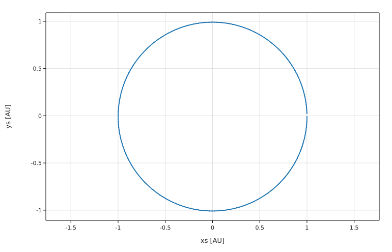
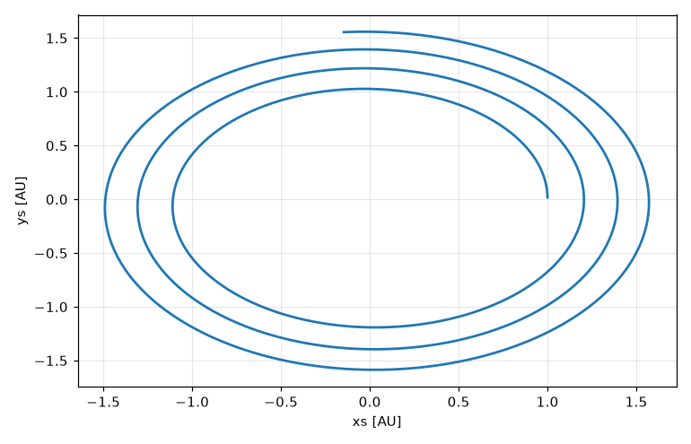
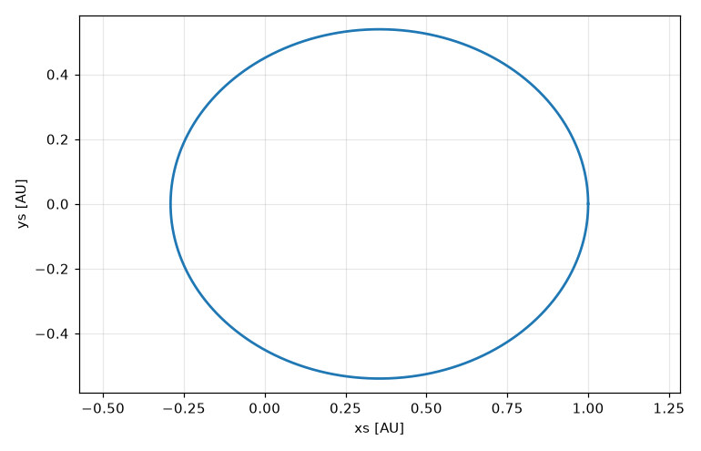

# Lesson 10 — Final project: simulate a planet's orbit from scratch

This is it: you'll use everything from the course to build a real physics simulation. By the end you'll have a program that computes the Earth's orbit around the Sun, checks itself, draws the orbit, and then discovers Kepler's laws on its own.

In Lesson 9 you saw that `solve` can do an orbit in five lines. Here you'll write the simulation **yourself**, with a loop, like the thrown ball in Lesson 4. That way you'll understand what a solver does inside, and you'll have a program you can extend in any direction: extra planets, a rocket engine, whatever you like.

Take it step by step. Type each program, run it, and make sure you understand the output before moving on.

## Step 1: The physics, on paper

Put the Sun at the origin and let the planet move in the x–y plane. Its position is (x, y) and its distance from the Sun is r = √(x² + y²).

Newton's law of gravitation says the acceleration points toward the Sun with size GM/r². Splitting it into x and y parts (the fraction x/r of it goes along x):

- aₓ = −GM x / r³
- a_y = −GM y / r³

where M is the mass of the Sun. That's all the physics we need.

## Step 2: Stepping forward in time

We can't solve these equations with a formula in general, but we can chop time into small steps dt, just as in Lesson 4. In each step:

1. Compute the acceleration from the current position.
2. Update the velocity: v ← v + a·dt.
3. Update the position **using the new velocity**: x ← x + v·dt.

That order (velocity first, then position) is called the **Euler–Cromer** method. It's a small detail with a big effect, as you'll see in Step 6.

What starting values? The Earth is 1 AU from the Sun and moves at about 29.78 km/s. Start it on the x-axis, at (1 AU, 0), moving in the +y direction.

## Step 3: The first version

```fermium
# Earth around the Sun, version 1
GM = G M_sun          # G times the mass of the Sun
dt = 1 day            # time step

# starting position and velocity
x = 1 AU
y = 0 AU
vx = 0 km/s
vy = 29.78 km/s

for day_number from 1 to 365
    r = sqrt(x^2 + y^2)
    ax = -GM x / r^3
    ay = -GM y / r^3
    vx += ax dt
    vy += ay dt
    x += vx dt
    y += vy dt

print "after 365 days: x =", x in AU, "y =", y in AU
```

<!-- output -->
```
after 365 days: x = 1.00002 AU y = -0.002767 AU
```

After 365 days, the Earth is back near (1 AU, 0), where it started. It works!

Notice how Fermium helped. Every line was unit-checked: if you had typed `vx += ax` (forgetting `dt`), Fermium would have refused to add an acceleration to a velocity. Try it!

## Step 4: Recording the path and drawing it

To draw the orbit we need every position, not just the last one. Collect them in lists with `push` (Lesson 5), then `plot`:

```fermium
# Earth around the Sun, version 2: draw the orbit
GM = G M_sun
dt = 1 day
x = 1 AU
y = 0 AU
vx = 0 km/s
vy = 29.78 km/s
xs = []
ys = []

for day_number from 1 to 365
    r = sqrt(x^2 + y^2)
    vx += -GM x / r^3 * dt
    vy += -GM y / r^3 * dt
    x += vx dt
    y += vy dt
    push(xs, x)
    push(ys, y)

print "recorded", len(xs), "positions"
plot ys in AU vs xs in AU to "my_orbit.png"
```

<!-- output -->
```
recorded 365 positions
plot saved to my_orbit.png
```

`plot ys in AU vs xs in AU` shows both axes in AU rather than metres. Open `my_orbit.png`:



A (nearly) circular orbit, just like the Earth's.

## Step 5: Is it right? Test your simulation

A simulation that *looks* right isn't necessarily right. Physicists test their code against things they know. Two good tests for an orbit:

- **Energy conservation.** The energy per kilogram of planet, E = ½v² − GM/r, must stay constant.
- **The period.** The Earth should come back after 365.25 days.

To measure the period, we watch for the moment `y` changes from negative to positive: that's the planet crossing the x-axis, completing a lap. We also switch to a `while` loop and a smaller step of 1 hour for more accuracy:

```fermium
# Earth around the Sun, version 3: test it
GM = G M_sun
dt = 1 hr
x = 1 AU
y = 0 AU
vx = 0 km/s
vy = 29.78 km/s
t = 0 s

energy(x, y, vx, vy) = ½ (vx^2 + vy^2) - GM / sqrt(x^2 + y^2)
E_start = energy(x, y, vx, vy)
period = 0 s

while t < 2 yr
    r = sqrt(x^2 + y^2)
    vx += -GM x / r^3 * dt
    vy += -GM y / r^3 * dt
    y_before = y
    x += vx dt
    y += vy dt
    t += dt
    if y_before < 0 AU and y >= 0 AU and period == 0 s
        period = t

E_end = energy(x, y, vx, vy)
print "energy per kg at start:", E_start
print "relative energy change after 2 years:", (E_end - E_start) / E_start
print "period:", period in day
```

<!-- output -->
```
energy per kg at start: -4.437×10⁸ J/kg
relative energy change after 2 years: 1.282×10⁻⁹
period: 365.125 day
```

- The energy is negative (the Earth is *bound* to the Sun) and changes by about one part in a billion over two years. Excellent.
- The period is 365.1 days, very close to the real 365.25 days. (The small difference comes from the rounded starting speed, and from measuring the crossing only once per time step. Extension 3 explores this.)

Our simulation passes both tests.

## Step 6: Why the order of the updates matters

What if you update the position *before* the velocity (the "obvious" order, called the **Euler** method)? Only two lines move:

```fermium
# The same simulation with the Euler method (position first)
GM = G M_sun
dt = 1 day
x = 1 AU
y = 0 AU
vx = 0 km/s
vy = 29.78 km/s
xs = []
ys = []

for day_number from 1 to 5 * 365
    r = sqrt(x^2 + y^2)
    ax = -GM x / r^3
    ay = -GM y / r^3
    x += vx dt
    y += vy dt
    vx += ax dt
    vy += ay dt
    push(xs, x)
    push(ys, y)

print "distance from the Sun after 5 years:", sqrt(x^2 + y^2) in AU
plot ys in AU vs xs in AU to "euler_orbit.png"
```

<!-- output -->
```
distance from the Sun after 5 years: 1.562 AU
plot saved to euler_orbit.png
```



The Earth spirals away from the Sun! The Euler method adds a little energy on every step, and the errors pile up. The Euler–Cromer method doesn't have this problem for orbits. Choosing a good method is a real part of computational physics, and it's the reason Fermium's `solve` uses a careful, adaptive method.

## Step 7: Discover Kepler's laws

Now use your simulation as a laboratory. Launch the planet more slowly (20 km/s instead of 29.78), so it's not fast enough for a circle. We run until it completes one orbit, and record the closest and furthest distances:

```fermium
# An eccentric orbit
GM = G M_sun
dt = 1 hr
x = 1 AU
y = 0 AU
vx = 0 km/s
vy = 20 km/s
t = 0 s
period = 0 s
r_min = 1 AU
r_max = 1 AU
xs = []
ys = []

while period == 0 s
    r = sqrt(x^2 + y^2)
    vx += -GM x / r^3 * dt
    vy += -GM y / r^3 * dt
    y_before = y
    x += vx dt
    y += vy dt
    t += dt
    r_min = min(r_min, r)
    r_max = max(r_max, r)
    push(xs, x)
    push(ys, y)
    if y_before < 0 AU and y >= 0 AU
        period = t

a = (r_min + r_max) / 2        # semi-major axis
print "closest to the Sun:", r_min in AU
print "furthest from the Sun:", r_max in AU
print "period:", period in yr
print "T^2 / a^3 =", period^2 / a^3 in yr^2/AU^3
plot ys in AU vs xs in AU to "eccentric_orbit.png"
```

<!-- output -->
```
closest to the Sun: 0.291068 AU
furthest from the Sun: 1 AU
period: 0.518709 yr
T^2 / a^3 = 1.00021 yr²/AU³
plot saved to eccentric_orbit.png
```



Look at what came out:

1. **Kepler's first law:** the orbit is an **ellipse**, with the Sun (at 0, 0) at one focus, not in the middle.
2. **Kepler's third law:** T²/a³ = 1 yr²/AU³, exactly as for the Earth (and for every planet in Lesson 5), even though this orbit looks completely different.

We didn't program either law. They came out of Newton's law of gravitation and a loop. That's the power of simulation.

## Step 8: Compare with `solve`

Finally, let's check our home-made simulation against Fermium's built-in solver for the same eccentric orbit:

```fermium
GM = G M_sun
solve
    x'' = -GM x / (x^2 + y^2)^1.5
    y'' = -GM y / (x^2 + y^2)^1.5
    with x(0) = 1 AU, y(0) = 0 AU, x'(0) = 0 km/s, y'(0) = 20 km/s
    for t from 0 yr to 0.5 yr
r(t) = sqrt(x(t)^2 + y(t)^2)
print "closest approach (solve):", min(x) in AU
print "distance after 0.25 yr:", r(0.25 yr) in AU to 3 digits
```

<!-- output -->
```
closest approach (solve): -0.291067 AU
distance after 0.25 yr: 0.302 AU
```

The closest approach is on the negative x-axis, so `min(x)` gives it (as a negative number): 0.291 AU, the same as our simulation. Your code agrees with a professional solver.

## Bonus: the same simulation with vectors

So far we kept x and y in separate variables and wrote every line twice. Physicists write the position as one **vector** **r** = (x, y), and Fermium has vectors too:

- `<1, 0> AU` is a vector with components 1 AU and 0 AU (angle brackets `<` `>`, commas between the components).
- `|r|` is its length, √(x² + y²).
- `r.x` and `r.y` are its components.
- Vectors add, subtract and multiply by numbers, just like on paper. (There's also `a · b` for the dot product and `a × b` for the cross product.)

Here is version 1 again. Newton's law becomes a single line, **a** = −GM **r**/|**r**|³:

```fermium
# Earth around the Sun, with vectors
GM = G M_sun
dt = 1 day
r = <1, 0> AU          # position
v = <0, 29.78> km/s    # velocity

for day_number from 1 to 365
    a = -GM r / |r|^3
    v += a dt
    r += v dt

print "after 365 days:", r in AU
print "distance from the Sun:", |r| in AU
```

<!-- output -->
```
after 365 days: <1.000, -0.002767> AU
distance from the Sun: 1.000 AU
```

The same numbers as version 1, and the loop is less than half as long. Units are checked on vectors too: `v += a` (forgetting `dt`) is still an error. To plot the orbit, `push(xs, r.x)` and `push(ys, r.y)` inside the loop, as in version 2. (A list can hold numbers but not whole vectors, so push the components.) And `solve` accepts vector equations as well: `solve r'' = -GM r / |r|^3 with r(0) = <1, 0> AU, r'(0) = <0, 29.78> km/s for t from 0 yr to 1 yr`.

## Bonus: a program you can hand to a friend

`fermium build` turns a program into a stand-alone app that runs without Fermium installed. It needs a C compiler; on a Mac, install Apple's free command line tools once with `xcode-select --install`. Save the vector program above as `orbit.fm`, then:

```
fermium build orbit.fm
./orbit
```

`./orbit` (the `./` means "the program in this folder") prints the same result as `fermium run orbit.fm`. Programs that use `plot`, `load` or `fit` can be built too: run them from the folder that has the data files, and plots come out as `.svg` files (open them in a web browser).

## Congratulations!

You've written a physics simulation from nothing, tested it, found a subtle numerical problem and fixed it, and used it to rediscover two of Kepler's laws. That's genuine computational physics. Everything you learned (variables, functions, loops, lists, units, plots, testing your code) carries over to Python, Julia, C++ or any other language you'll meet.

## Project extensions

Pick one or more. Solutions for the first four are in the solutions file.

1. **Mars.** Simulate Mars: a = 1.524 AU, speed 24.07 km/s. What's its period in years? Compare with Kepler's third law, T = a^(3/2) in years.
2. **Escape!** Find the smallest starting speed at 1 AU for which the planet never comes back (its energy is ≥ 0). Try launching at 40, 42 and 44 km/s and check the sign of E. Compare with the escape velocity √(2GM/r).
3. **Time step study.** Run version 3 with dt = 1 day, 6 hr, 1 hr and 10 min. How does the error in the period depend on dt?
4. **A function for the force.** Rewrite version 3 so the acceleration is computed by functions `ax(x, y)` and `ay(x, y)`. It's a good habit: the physics is in one place and easy to change.
5. **Challenge: Kepler's second law.** A planet sweeps out equal areas in equal times. In each step, the area swept is ½ |x·v_y − y·vₓ| dt. Record it for every step of the eccentric orbit and show that it's constant. (With vectors, that's `½ |r × v| dt`.)
6. **Challenge: Jupiter's pull.** Add Jupiter (at 5.2 AU, 13.1 km/s, mass 1.898e27 kg) as a second body in the loop, and let the Earth feel both the Sun and Jupiter. (You'll need the Earth–Jupiter distance and a force from each.) Does the Earth's orbit change over 12 years?

Solutions: [solutions/lesson10.md](solutions/lesson10.md)

**Where to go next:** the [language reference](../docs/reference.md) has every feature, and the `examples/` folder has dozens of physics programs to read and modify. Pick a problem from your physics course and solve it in Fermium. Good luck!
