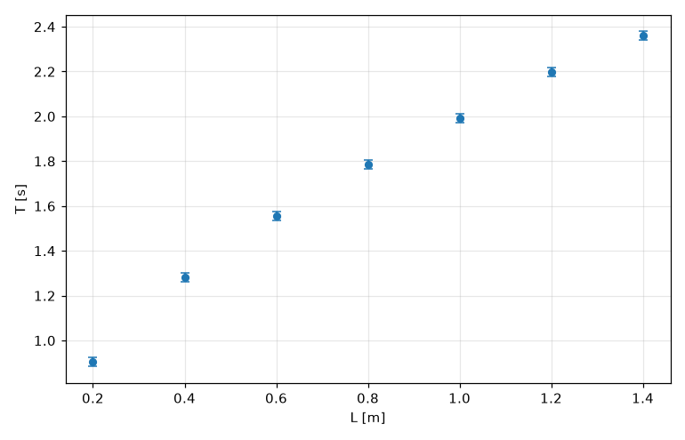

# Lesson 12 (bonus) — Lab reports: measurements with uncertainties

No measurement is exact. A tape measure gives the length of a pendulum to about a centimetre, and a stopwatch in your hand is good to maybe a tenth of a second. A lab report has to say how much a result can be trusted, so every number comes with an **uncertainty**: g = 9.70 ± 0.19 m/s².

Working that out by hand ("error propagation") is tedious, and it's easy to get wrong. Fermium does it for you, with the units checked as always.

## Writing a measurement

Put `±` between the value and its uncertainty. The unit at the end belongs to both numbers:

```fermium
L = 1.20 ± 0.01 m
T = 2.21 ± 0.02 s
print L, T
print L in cm
```

<!-- output -->
```
1.200 ± 0.010 m 2.210 ± 0.020 s
120.0 ± 1.0 cm
```

- The ASCII spelling is `+-` (`L = 1.20 +- 0.01 m`). In VS Code, `\pm` then Tab types ± (Lesson 2b); on a Mac it's Option + Shift + =.
- `(1.20 ± 0.01) m` means the same thing.
- **How it prints:** the uncertainty is rounded to **2 significant figures**, and the value to the same decimal place. That's the usual rule in lab reports: digits beyond the uncertainty mean nothing, so they aren't shown.
- `x ± 3%` gives a *relative* uncertainty: 3 % of x.

## Error propagation

Now the pendulum formula from Lesson 2, with the measured values:

```fermium
L = 1.20 ± 0.01 m
T = 2.21 ± 0.02 s
g = 4π² L / T²
print "g =", g
print "relative uncertainties:", rel(L) to 2 digits, rel(T) to 2 digits, rel(g) to 2 digits
```

<!-- output -->
```
g = 9.70 ± 0.19 m/s²
relative uncertainties: 0.0083 0.0090 0.020
```

Fermium used the standard (first-order) propagation rule that your lab manual has: for g = 4π² L / T²,

  (σ_g / g)² = (σ_L / L)² + (2 σ_T / T)²

`rel(x)` is the relative uncertainty σ/|x|. Here L is known to 0.8 % and T to 0.9 %, but T is squared, so it counts twice: 2 × 0.9 % = 1.8 %, and together they give 2.0 %. **The period is the measurement to improve.**

`value(x)` and `uncertainty(x)` give the two parts as plain numbers, if you need them.

The rule works through any formula: `sin`, `exp`, `√`, powers, your own functions, even derivatives. You never write a partial derivative yourself.

## Using a measurement twice

A value that appears twice in a formula isn't two independent measurements. Fermium keeps track of where each uncertainty came from:

```fermium
L = 1.20 ± 0.01 m
print L - L
print L / L
print L * L, "but for two separate measurements:", (1.20 ± 0.01 m) * (1.20 ± 0.01 m)
```

<!-- output -->
```
0 ± 0 m
1 ± 0
1.440 ± 0.024 m² but for two separate measurements: 1.440 ± 0.017 m²
```

L − L is exactly zero, with no uncertainty, because both L's are the same measurement: if L is really a bit longer, both are. The rule "add the uncertainties in quadrature" would say ±0.014 m, which is wrong. The last line shows the difference: every `±` you write is a new, independent measurement.

## Timing many swings, and repeated measurements

Two classic tricks to measure a period better.

**Time ten swings and divide by ten.** Your reaction time adds the same ±0.2 s whether you time one swing or ten, so the uncertainty of one period shrinks tenfold:

```fermium
L = 1.20 ± 0.01 m
T10 = 22.1 ± 0.2 s
T = T10 / 10
print "one period:", T
print "g =", 4π² L / T²
```

<!-- output -->
```
one period: 2.210 ± 0.020 s
g = 9.70 ± 0.19 m/s²
```

**Repeat the measurement.** The mean of N readings is uncertain by (standard deviation)/√N, the *standard error of the mean*:

```fermium
Ts = [2.19 s, 2.23 s, 2.20 s, 2.24 s, 2.18 s]
T = mean(Ts) ± std(Ts) / √len(Ts)
print "mean period:", T
```

<!-- output -->
```
mean period: 2.208 ± 0.012 s
```

## g from a fit, with error bars

In Lesson 6 you fitted g to the pendulum data. In a program that uses uncertainties, the fitted parameters come out as uncertain values: the fit's standard errors (and the correlations between parameters, when there are several) go into every formula you use them in. Here we also give each period in the file an uncertainty of ±0.02 s, so the plot gets error bars (the fit itself treats all points equally; weighted fits are not supported yet):

```fermium
data = load "data/pendulum.csv"
fit T = 2π √(L / g) to data
print "g from the fit:", g
print "g − g_n =", g - g_n, "which is", (value(g) - g_n) / uncertainty(g) to 2 digits, "standard deviations"
T = data.T ± 0.02 s
plot T vs data.L to "pendulum_errorbars.png"
```

<!-- output -->
```
fit T = 2π √(L/g)   (7 data points from data/pendulum.csv)
  g = 9.856 m/s²   (standard error 0.038 m/s²)
  rms residual = 0.00850 s
g from the fit: 9.856 ± 0.038 m/s²
g − g_n = 0.049 ± 0.038 m/s² which is 1.3 standard deviations
plot saved to /Users/ada/fermium/bootcamp/pendulum_errorbars.png
```



The fit is five times more precise than one pair of L and T, because it uses seven. It differs from standard gravity (`g_n` = 9.80665 m/s²) by 1.3 standard deviations. That's normal: a real result is more than one σ off about a third of the time. A difference of 3σ or more would mean something is wrong with the experiment (or with the physics).

(In a program with no `±` or `uncertainty(…)` anywhere, `fit` behaves as in Lesson 6: the parameters are plain numbers, and `err(g)` gives the standard error.)

## When the formula isn't linear enough: Monte Carlo

The propagation rule assumes that the formula is close to a straight line over the range of the uncertainty. Usually it is. When it isn't, Fermium can simulate the experiment instead: `propagate montecarlo` runs the formulas below it 100 000 times, each time with every measurement drawn at random from its uncertainty, and reports the mean ± the standard deviation of the results.

A projectile launched at 45° goes farthest, so a small change of angle hardly changes the range: the slope there is zero. Linear propagation then ignores the angle's uncertainty completely:

```fermium
v = 10.0 ± 0.1 m/s
θ = 45 ± 5°
print "linear rule:", v² sin(2θ) / g_n
propagate montecarlo
    R = v² sin(2θ) / g_n
print "Monte Carlo:", R
```

<!-- output -->
```
linear rule: 10.20 ± 0.20 m
Monte Carlo: 10.04 ± 0.30 m
```

The simulation shows what really happens: any error in the angle makes the range *shorter*, so the average is lower (10.04 m, not 10.20 m) and the spread is bigger. For a nearly linear formula like 4π² L / T², the two methods agree.

- `propagate montecarlo 20000 samples` sets the number of runs.
- The random numbers come from Fermium's seeded generator (the one behind `rand()`, reference §20): the same program gives the same answer every time, and `seed(n)` before the block picks a different set.
- Only formulas (`name = …`) go inside the block; print the results after it.
- Integrals and differential equations can't take uncertain values directly yet, but they work inside a `propagate montecarlo` block.

## Summary

- `x = 1.20 ± 0.01 m` (or `+-`) is a measurement. `x ± 3%` is a relative uncertainty.
- Formulas propagate uncertainties automatically, with units checked, and with correlations handled exactly (L − L = 0 ± 0).
- Results print in lab-report style: the uncertainty to 2 significant figures, the value to match.
- `value(x)`, `uncertainty(x)` and `rel(x)` give the parts.
- A fit in a program that uses uncertainties returns uncertain parameters. Plotting uncertain values draws error bars.
- `propagate montecarlo` simulates the measurement when the formula is too curved for the linear rule.
- **Limits:** a program with uncertainties runs in Fermium's slower interpreter, can't be turned into a standalone program with `fermium build`, and doesn't work in the REPL or Jupyter yet.

## Exercises

1. **A density.** A metal cylinder has mass m = 245.3 ± 0.1 g, diameter d = 2.54 ± 0.01 cm and height h = 5.08 ± 0.02 cm. Find its density ρ = m / (π (d/2)² h) in g/cm³. Which measurement limits the result? (Compare `rel` of each input, remembering d is squared.)
2. **Radioactive decay.** A sample's count rate falls from R₀ = 1250 ± 35 counts/s to R = 410 ± 20 counts/s in t = 30.0 ± 0.1 min. Find the half-life t½ = t ln 2 / ln(R₀/R) in minutes.
3. **Monte Carlo versus linear.** The kinetic energy of a cart is E = ½ m v² with m = 0.500 ± 0.005 kg and v = 0.20 ± 0.15 m/s (a very rough speed). Compare the linear rule with `propagate montecarlo`. Why does the Monte Carlo mean come out larger than ½ m v²?

Solutions: [solutions/lesson12.md](solutions/lesson12.md)

**Back to:** [the list of lessons](README.md)
