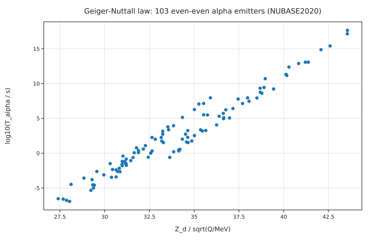
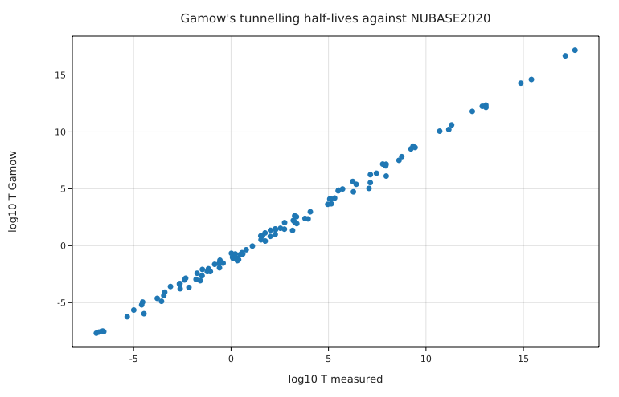

# Alpha decay: Gamow's tunnelling theory and the Geiger–Nuttall law against NUBASE2020

**Physics.** An α particle of energy Q inside a nucleus hits the Coulomb barrier V(r) = 2Z_d e²/(4πε₀r) of the daughter
(Z_d = Z − 2) about 10²¹ times a second and leaks through with probability e^{−2G}, where (Gamow 1928; Gurney & Condon 1928)

G = (√(2μ)/ħ) ∫_R^b √(V(r) − Q) dr,   R = r₀(A_d^(1/3) + 4^(1/3)),   b = 2Z_d e²/(4πε₀Q).

So T½ = ln 2 / (f e^{−2G}) with f = v/(2R), and log T½ is nearly linear in Z_d/√Q: the Geiger–Nuttall law, which spans
more than 24 orders of magnitude. The Viola–Seaborg form log₁₀T = (aZ + b)/√Q + cZ + d is its standard parametrisation.

**Data.** NUBASE2020 (Kondev et al. 2021), downloaded from the IAEA AMDC (see [SOURCE.md](SOURCE.md)). `prepare.py` selects the 103
even–even ground states with Z = 84–104 that have a measured half-life, mass excess and α branch, computes
Q = Δ(parent) − Δ(daughter) − Δ(⁴He) from the NUBASE mass excesses and the partial α half-life T½/b_α.

**Code.** [`alpha.fm`](alpha.fm) computes G for every emitter with `∫ √(barrier(Zd, r) - Q) dr from R to b` (the integrand
has a square-root zero at the turning point; the quadrature handles it), checks it against the closed form for ²³⁸U,
and compares the Gamow half-lives (r₀ = 1.2 fm, speed inside from a 35 MeV well as in Krane ch. 8) with the measured ones.
It evaluates the Viola–Seaborg formula with the published coefficients of Sobiczewski, Patyk & Ćwiok (1989) and fits the
same form to the data. Run it from this folder with `fermium run alpha.fm` (0.3 s).

## Results

| quantity | Fermium | published / measured | |
|---|---|---|---|
| G for ²³⁸U: `∫` vs closed form | 43.997919 vs 43.997919 | | the quadrature is exact to 8 digits |
| Gamow model, log₁₀(T_meas/T_Gamow), all 103 | mean **0.99**, scatter 0.35 | | 24.6 decades of half-life |
| implied preformation factor | 10^(−0.99) ≈ **0.10** | α-preformation probabilities of heavy nuclei are of order 0.01–0.1 (textbook statement, not a specific table) | |
| ²³⁸U log₁₀ T_α/s | Gamow 16.68 | **17.15** (4.468 × 10⁹ y) | NUBASE2020 |
| ²³²Th | 17.17 | 17.65 | |
| ²²⁶Ra | 10.07 | 10.70 | |
| ²¹²Po | −7.55 | −6.53 (294 ns) | |
| ²¹⁰Po (N = 126) | 5.03 | 7.08 | 2 decades slower: the closed neutron shell |
| Viola–Seaborg, Sobiczewski et al. coefficients, N > 126 (67 nuclei) | mean **−0.007**, rms **0.20** | the region the coefficients were fitted to | Sobiczewski et al. 1989 |
| same, N ≤ 126 (36 nuclei) | mean +0.87, rms 0.93 | outside the fit region: the formula fails there | |
| Viola–Seaborg fitted to all 103 | rms 0.343 (a = 0.76, b = 71.6, c = 0.08, d = −58.5, strongly correlated) | | |

**Honest reading.** Gamow's one-parameter-free model gets 24 decades of half-lives right to a factor ~10 (the
preformation factor), with a scatter of a factor 2.2 about that. The published Viola–Seaborg coefficients reproduce the
N > 126 nuclei to 0.2 decades, exactly what they were fitted for; for the neutron-deficient isotopes below the N = 126
shell they are nearly a decade off. A fit of the same four coefficients to all 103 nuclei gets 0.34, but the coefficients
are poorly determined (a, b, c, d are strongly correlated), so they are not comparable one by one with Sobiczewski's.
Q uses atomic mass excesses; the electron screening correction (~30 keV for heavy nuclei) is left out.

## Friction
- `(A - 4) u` (atomic mass units after a bracket) is read as a variable `u`; it must be written `(A - 4) [u]`. Clear
  error, but the bracket rule bites often with `u`.
- `vs` can't be a function name (it's the plot keyword); the error said only "didn't expect 'vs' here".
- Fermium warned that `ν` and `v` look alike (both were used in the same function); renamed.
- A small function returning three numbers used a vector `<k, mean, rms>`; there are no tuples or records.
