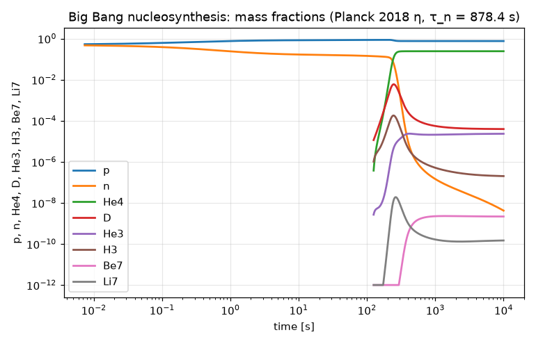
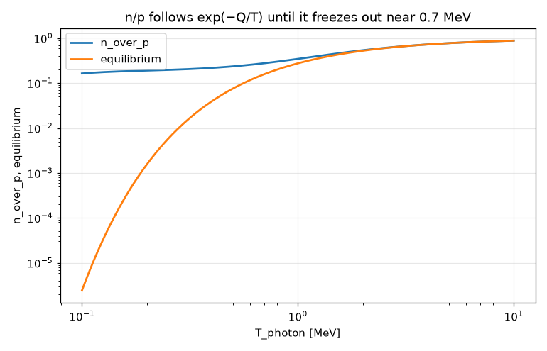

# Big Bang nucleosynthesis: a stiff reaction network from 10 MeV to 10⁴ s

**Physics.** In the first seconds the universe is a radiation-dominated plasma of photons, e± pairs, three neutrino
species and a trace of baryons (η = n_b/n_γ ≈ 6×10⁻¹⁰). Weak interactions (n + ν ↔ p + e⁻, n + e⁺ ↔ p + ν̄,
n → p + e⁻ + ν̄) hold n/p = exp(−Q/T), Q = 1.293 MeV, until their rate falls below the expansion rate H near
T ≈ 0.7 MeV (freeze-out). After that n/p only drops by free decay. Deuterium forms by p(n,γ)d, but as long as
there are more than ~1/η photons per baryon above its 2.22 MeV binding energy it is broken up again (the
*deuterium bottleneck*). Below T ≈ 0.07 MeV (t ≈ 4 min) it survives, and within a few minutes almost every
neutron ends up in ⁴He: Y_p ≈ 2(n/p)/(1 + n/p) ≈ 0.25. Traces of D, ³H, ³He, ⁷Li and ⁷Be are left over.

The network follows Wagoner (1969) and Kawano's NUC123 code (Kawano 1992, FERMILAB-Pub-92/04-A): abundances
Y_i = n_i/n_b (number per baryon; mass fraction X_i = A_i Y_i), with, for each reaction, the forward rate minus the
reverse rate from detailed balance:

- two-body, a + b → c + d: F = n_b⟨σv⟩ (Y_a Y_b − r Y_c Y_d), with r = ⟨σv⟩_rev/⟨σv⟩ = (g_a g_b/g_c g_d)(μ_ab/μ_cd)^{3/2} e^{−Q/T}
  (and Y²/2 for two identical particles);
- radiative capture, a + b → c + γ: F = ⟨σv⟩ [n_b Y_a Y_b − (g_a g_b/g_c)(μc²T/2πħ²c²)^{3/2} e^{−Q/T} Y_c].

The background is computed, not fitted: H² = 8πG(ρ_γ + ρ_e± + ρ_ν)/3c² with the e± energy density and pressure
integrated over the Fermi–Dirac distribution with the electron mass; T(t) from entropy conservation,
dT/dt = −3H T s/(dρ/dT) for photons + e±; the neutrinos decoupled (T_ν ∝ 1/a, from s_γe a³ = constant), so the
e± annihilation heats the photons and T/T_ν → (11/4)^{1/3}. The baryon density scales like T_ν³.
The weak rates are the Born-approximation phase-space integrals over electron energy ε = E/m_ec² (with separate
electron and neutrino temperatures), normalised so that λ(n → p) → 1/τ_n at T = 0:

λ(n→p) = 1/(τ_n λ₀) ∫₁^∞ ε√(ε²−1) [(ε−q)²(1−f_e(ε)) f_ν(ε−q) + (ε+q)² f_e(ε)(1−f_ν(ε+q))] dε,  q = Q/m_ec²,

λ₀ = ∫₁^q ε√(ε²−1)(q−ε)² dε = 1.636, and λ(p→n) is the same with q → −q.

**Inputs.** Ω_b h² = 0.0224 (Planck 2018 VI), turned into η₁₀ = 6.132 with T_CMB = 2.7255 K and the mean mass per
baryon of today's H + ⁴He (the usual conversion η₁₀ ≈ 274 Ω_b h² gives 6.14); τ_n = 878.4 s; Q = 1.29333 MeV; reaction Q values from
AME2020 masses; spins g: n, p, ³H, ³He = 2, d = 3, ⁴He = 1, ⁷Li, ⁷Be = 4; μ from the mass numbers.

**Reaction rates** (N_A⟨σv⟩ in cm³ mol⁻¹ s⁻¹ as functions of T₉, in the forms coded in NUC123):

| reaction | source of the fit | NUC123 reaction |
|---|---|---|
| n ↔ p | Born integrals above, normalised to τ_n (Weinberg 1972; Dicus et al. 1982, PRD 26, 2694; Bernstein, Brown & Feinberg 1989, RMP 61, 25) | |
| p(n,γ)d | Smith, Kawano & Malaney 1993 (ApJS 85, 219) | 12 |
| d(p,γ)³He | Smith, Kawano & Malaney 1993 | 20 |
| d(d,n)³He | Smith, Kawano & Malaney 1993 | 28 |
| d(d,p)t | Smith, Kawano & Malaney 1993 | 29 |
| ³He(n,p)t | Smith, Kawano & Malaney 1993 | 16 |
| t(d,n)⁴He | Smith, Kawano & Malaney 1993 | 30 |
| ³He(d,p)⁴He | Smith, Kawano & Malaney 1993 | 31 |
| ³He(α,γ)⁷Be | Smith, Kawano & Malaney 1993 (not CF88, as the first version of this table said) | 27 |
| t(α,γ)⁷Li | Smith, Kawano & Malaney 1993 (not CF88, as the first version of this table said) | 26 |
| ⁷Be(n,p)⁷Li | Smith, Kawano & Malaney 1993 | 17 |
| ⁷Li(p,α)⁴He | Caughlan & Fowler 1988 (ADNDT 40, 283): ⁷Li(p,α)⁴He plus ⁷Li(p,γ)⁸Be (⁸Be → 2α) | 24 |

**Source check (spec A8.3, 2026-09-26).** The coefficients were first typed in from memory, offline. They have now
been compared, number by number, with subroutine `rate2` of Kawano's NUC123 version 4.1 (December 1991), the code
that implements the Smith, Kawano & Malaney fits, in the copy at
https://github.com/ckald/KAWANO-sterile/blob/master/nuc123.f (a sterile-neutrino fork; its header and `rate2` are
Kawano's version 4.1). Result:
- **10 of the 11 nuclear rates agree in every coefficient.**
- **³He(α,γ)⁷Be had one wrong number:** the second term's scaled temperature is T₉/(1 + 0.1071 T₉) in NUC123,
  and had been typed as T₉/(1 + 0.0495 T₉), which is the scaling Caughlan & Fowler 1988 use in *their* (different,
  one-term) fit of the same reaction. Fixed in `bbn.fm` and in the test's independent NumPy model; the effect on
  the results is in the table below.
- **Attribution:** the ³He(α,γ)⁷Be and t(α,γ)⁷Li forms are Smith, Kawano & Malaney's, not CF88's. CF88's own fits,
  read from the transcription of the CF88 tables hosted by CIAE (http://www.nuclear.csdb.cn/data/CF88/analyt_rates.html,
  a mirror of the former ORNL page), are 5.61×10⁶ T₉ₐ^{5/6} T₉^{−3/2} e^{−12.826/T₉ₐ^{1/3}} and
  8.67×10⁵ T₉^{−2/3} e^{−8.080/T₉^{1/3}}(1 + …) respectively. The table above is corrected.
- ⁷Li(p,α): NUC123's reaction 24 is CF88's ⁷Li(p,α)⁴He (first three terms, identical to the CIAE transcription)
  plus CF88's ⁷Li(p,γ)⁸Be. In that second part the transcription prints +2.498 T₉^{2/3} where NUC123 has −2.498;
  `bbn.fm` keeps NUC123's sign. The two signs change the total rate by less than 0.05 % between T₉ = 0.1 and 2, so
  no printed digit depends on it.
- Not reached: the Smith, Kawano & Malaney paper itself (the ADS scan returned an HTML page instead of the PDF, and
  the scans have no text layer to check against) and Kawano's 1992 Fermilab report (the lss.fnal.gov PDF is a
  6-page image scan). The check is therefore against the authors' code, not the printed tables.

Two further checks on the rates: every reverse coefficient recomputed here from detailed balance reproduces
the published NUC123 reverse factors (4.7×10⁹ T₉^{3/2} e^{−25.82/T₉} for d photodisintegration, 1.63×10¹⁰, 1.73,
5.54, 4.64, …) to about 1 %; and the yields below land within a few per cent of modern codes for D, ³He and ⁷Li.
The fits are made for T₉ ≤ 10; above that (T > 0.86 MeV) the program holds them at T₉ = 10. The nuclei are in
equilibrium there, set by the reverse rates (which use the true T), so the forward rates only have to be fast.

**Code.** [`bbn.fm`](bbn.fm), 236 lines; run it from this folder with `fermium run bbn.fm` (about 30 s). The rates,
detailed balance and the plasma thermodynamics are written as formulas with units (T is written as an energy,
k_B T in MeV, as BBN papers do), and the eight abundance equations are written out reaction by reaction. It solves
in two stages, both `using radau`:
1. **the weak era**, T = 10 MeV (t = 0.0074 s) down to 0.1 MeV (t = 119 s, `until Tw = T1`): T and Y_n only;
2. **nucleosynthesis**, the whole network (T and eight abundances) from 0.1 MeV to t = 10⁴ s (T = 0.0115 MeV), with the
   nuclei started at 0. Above 0.1 MeV they are held at tiny equilibrium values by photodisintegration (D/H is
   2×10⁻¹¹ at 0.3 MeV and 10⁻⁶ at 0.1 MeV) and restart from 0 within a fraction of a second.

The split is not physics: Fermium's stiff solver can't run the whole network from 10 MeV (see below). The test
checks that it costs nothing, by solving the whole network in **one** SciPy Radau run from 10 MeV (rtol 10⁻¹⁰,
atol 10⁻¹⁶), and it recomputes every printed number with an independent NumPy implementation of the model
(Gauss–Legendre quadratures instead of Fermium's adaptive Gauss–Kronrod).

## Results

| quantity | Fermium | SciPy, same network (one solve from 10 MeV) | PRIMAT (Pitrou et al. 2018, Phys. Rep. 754, 1) | Fields et al. 2020 (JCAP 03, 010) | observed (PDG 2024) |
|---|---|---|---|---|---|
| Y_p (⁴He mass fraction) | **0.242340** | 0.2423403 | 0.24709 | 0.2471 | 0.245 ± 0.003 |
| D/H | **2.59588×10⁻⁵** | 2.595881×10⁻⁵ | 2.459×10⁻⁵ | 2.51×10⁻⁵ | (2.55 ± 0.03)×10⁻⁵ |
| ³He/H (+ ³H) | **1.02875×10⁻⁵** | 1.028747×10⁻⁵ | 1.074×10⁻⁵ | ≈ 1.0×10⁻⁵ | ≲ (1.1 ± 0.2)×10⁻⁵ (Bania et al. 2002) |
| ⁷Li/H (+ ⁷Be) | **4.36404×10⁻¹⁰** (5.10191×10⁻¹⁰ before the A8.3 fix) | 4.364051×10⁻¹⁰ | 5.623×10⁻¹⁰ | ≈ 4.7×10⁻¹⁰ | (1.6 ± 0.3)×10⁻¹⁰ (the "lithium problem") |

Fermium and SciPy agree to 3×10⁻⁶ or better on all four (the test requires 10⁻⁴), and baryon number
Σ A_i Y_i is conserved to 7×10⁻¹⁶.

| milestone | Fermium | textbook |
|---|---|---|
| weak freeze-out, λ(n→p) = H | T = 0.705 MeV (t ≈ 1.5 s) | ≈ 0.7–0.8 MeV |
| n/p: at 3, 1, 0.7, 0.5, 0.3 MeV | 0.653, 0.345, 0.276, 0.235, 0.203 | equilibrium e^{−Q/T}: 0.650, 0.274, 0.158, 0.075, 0.013 |
| n/p at 0.1 MeV (t = 119 s) | 0.163; free decay alone brings it to 0.138 ≈ 1/7 by 247 s, and 2 X_n = 0.243 ≈ Y_p | ≈ 1/7 at nucleosynthesis |
| deuterium bottleneck: D/H peaks | t = 247 s, T = 0.0725 MeV, D/H = 3.7×10⁻³ | T ≈ 0.07–0.08 MeV, t ≈ 3–4 min |
| half of the ⁴He made | t = 246.7 s, T = 0.0724 MeV | |
| T/T_ν at the end | 1.40102 | (11/4)^{1/3} = 1.40102 |

**Where the simple network falls short, and why.**
- **Y_p is 0.0048 (1.9 %) low.** This is the known shortfall of Born-approximation weak rates normalised to τ_n.
  Missing: the Coulomb (Fermi-function) correction, zero- and finite-temperature radiative corrections, finite
  nucleon mass (recoil, weak magnetism), incomplete neutrino decoupling and QED plasma corrections (N_eff = 3.044
  instead of 3), all of which modern codes include. Y_p is sensitive to how the weak rates are normalised. The
  test also solves the network with both rates scaled by λ₀/λ₀,Coulomb = 1.636/1.6887 (as if the 3 % Coulomb
  enhancement of neutron decay didn't act at freeze-out). That gives Y_p = 0.2480, above the modern value, so the
  full set of corrections lies between the two.
- **D/H is 3–6 % high** compared with Fields et al. and PRIMAT. The 1993 fits for d(p,γ)³He and the d + d reactions
  are older than today's data: the LUNA d(p,γ)³He measurement (Mossa et al. 2020, Nature 587, 210) destroys D faster. The slightly
  different η conversion and the missing weak corrections also play a part. It is still within 2 % of the
  observed D/H.
- **³He/H** agrees with modern values to 4 %. **⁷Li/H** = 4.36×10⁻¹⁰ is 7 % below Fields (≈ 4.7) and 22 % below
  PRIMAT (5.6), and 2.7× the Spite-plateau value: the lithium problem is reproduced. The gap to the modern codes
  is not analysed here (the 1993 rate fits, especially ³He(α,γ)⁷Be, which makes most of the ⁷Li, are older than
  the data those codes use; that is a likely cause, not a checked one). Before the
  source check (above) the program had 5.10×10⁻¹⁰, which happened to sit between the two modern values: one
  wrong coefficient in ³He(α,γ)⁷Be made it 17 % too high. Y_p, D/H and ³He/H did not change in any printed digit. Most ⁷Li comes from ⁷Be (made by
  ³He(α,γ)), which later captures an electron.
- The network is the 12 reactions (n ↔ p and 11 nuclear) that Smith, Kawano & Malaney single out as the important
  ones for these yields. It leaves out ⁶Li, ⁷Be(n,α), ⁷Be(d,p)2α, ⁷Li(d,n)2α, heavier nuclei, and the ³H and ⁷Be
  decays (they happen long after 10⁴ s, so ³H is counted as ³He and ⁷Be as ⁷Li).
  Rate uncertainties (a few % for D and ³He, ~10 % for ⁷Li) are not propagated.

## What writing it in Fermium showed
- **The physics reads like the paper.** Detailed balance is one line with units,
  `saha(g, μ, Q, T) = g (μ m_u c² T / (2π (ħ c)²))^(3/2) exp(-Q / T)`. The e± thermodynamics are ∫ over the
  Fermi–Dirac occupation inside ordinary functions. `until Tw = T1` ends the weak era at a temperature,
  `solve Tw(tq) = Tq for tq …` finds when the plasma crossed each temperature, and `solve λ_np(Tf) = H(Tf) …`
  finds the freeze-out, with integrals inside the root find. Units are checked through every term: a capture
  term n_b⟨σv⟩Y_aY_b and its photodisintegration term ⟨σv⟩(μc²T/2πħ²c²)^{3/2}Y_c must both come out in 1/s,
  which settles where N_A and the (ħc)³ go.
- **The stiff solver can't start the network at 10 MeV (the main limitation found).** At 10 MeV the deuterium
  photodisintegration rate is ~10¹⁷ s⁻¹ against an age of 0.007 s. Fermium's `using radau` controls the error
  purely relative to each component (DECISIONS D42), so it also tries to follow ³H, ³He, ⁷Li and ⁷Be at their
  equilibrium values of 10⁻²³–10⁻⁶⁸. Every attempt ended with "the ODE solver's step became too small near
  t = 0.00738 s; the solution may blow up there". Starting the network at 0.2, 0.18 or 0.15 MeV failed the same way
  (near 22.8, 29.1, 45.0 s); 0.12 and 0.1 MeV work. SciPy's Radau has the same trouble with a pure relative
  tolerance (atol ≤ 10⁻¹⁸ fails at the first step), and works from 10 MeV with an absolute tolerance of 10⁻¹⁶ on
  the abundances. Fermium has no way to set an absolute tolerance (`tolerance r` is relative only), hence the two
  stages. The message also points the wrong way: nothing blows up, the error control asks for relative accuracy
  on numbers that are rounding noise.
  *Update (FRICTION #82, DECISIONS D160):* `absolute 1e-16, 1e-16 MeV` after the range now gives the solver an
  absolute tolerance, and the whole network runs from 10 MeV in one `using radau` solve, matching SciPy to 10⁻⁵
  (tests/test_research.py); without it the message now says this is probably not a blow-up and suggests
  `absolute`. `bbn.fm` keeps its two stages, as published.
- **Every function call is computed again.** `n_b(T)` needs T_ν(T), which needs two quadratures, and it is called
  by nine reaction terms that each appear in 2–4 equations. So one evaluation of the right-hand side does dozens of
  adaptive integrals. There is no way to name an intermediate value once per evaluation inside a `solve` block
  (a `where` for a system of equations, or local definitions). The program still runs in ~30 s because the
  integrals are compiled.
- **A reaction network has to be written by hand.** There are no arrays of unknowns, so each reaction's net rate is
  a function with its own argument list (`F_h3n(T, Y3He, Yn, Yp, Y3H)`), and it has to be added by hand, with the
  right sign and multiplicity, to every equation it touches. A loop over a table of reactions isn't possible.
- **Variable names that are units.** `Yb` (for ⁷Be) is the yottabarn: `7 Yb[end]` is an error ("'7 Yb' means 7 of
  the unit Yb"); the variables were renamed `Y7Be`, `Y7Li`, …. With a temperature `T`, `π²/15 T⁴` and `4/3 T` read
  `15 T` and `3 T` as tesla. The errors say so clearly ("'15 T' was read as a unit"), but only after a
  unit-mismatch message in powers of kg, A and s. And `2/π² T⁴` means 2/(π² T⁴) (Fermium warns). BBN formulas are
  full of these coefficient-times-T products, so the program writes `(π²/15) T⁴` and `(2/π²) T⁴` throughout.
- **A unit can't be given a name:** `rate = cm³/(mol s)` is an error ("cm is a unit; units go right after a
  number"); `rate = 1 cm³/(mol s)` works.
- **Plots:** there is no y-range option, so the abundances are floored at 10⁻¹² by hand in a loop (without the
  floor, ⁷Be's 10⁻⁶⁸ start sets the axis). `max(list, number)` doesn't work element by element ("this value must be
  a number, but it is a list"). A solution's samples have to be copied into lists one element at a time. The axis
  label is the list name, so the lists are called `time`, `He4`, `D`…. The temperature axis can't be reversed
  (the classic figure has T decreasing to the right).
