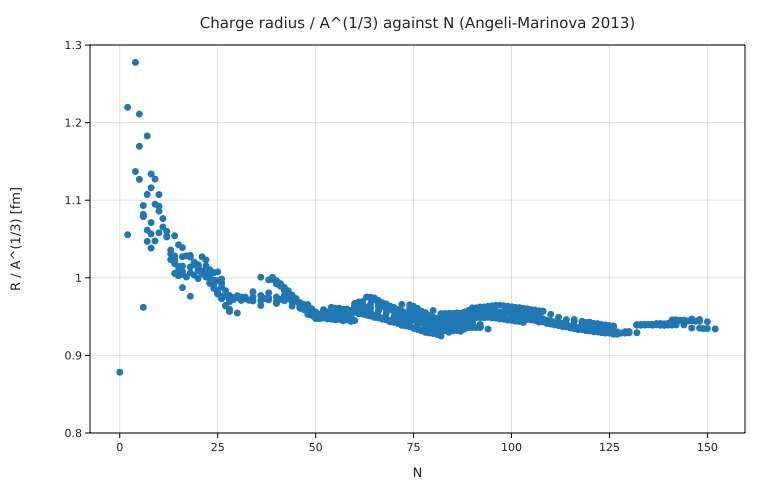
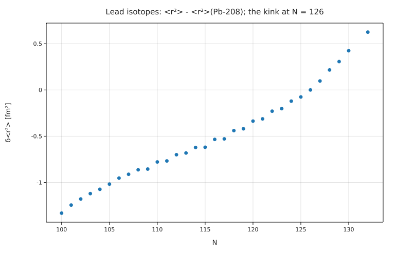

# Nuclear charge radii against the Angeli–Marinova table

**Physics.** Nuclear matter has nearly constant density, so a nucleus of A nucleons has a radius ∝ A^(1/3). Electron
scattering, muonic atoms and optical isotope shifts measure the rms charge radius R = ⟨r²⟩^(1/2). The smooth law
misses shell structure: at a closed neutron shell the radius stops growing (⁴⁰Ca and ⁴⁸Ca are the same size) and past it
⟨r²⟩ grows faster (the "kink" at N = 126 in lead). The equivalent uniform sphere has R_eq² = (5/3)⟨r²⟩; the textbook
radius parameter is R₀ ≈ 1.2 fm (R_eq = R₀ A^(1/3); K. S. Krane, *Introductory Nuclear Physics*, ch. 3). A Fermi (Woods–Saxon)
distribution ρ ∝ 1/(1 + e^{(r−c)/a}) with c = 1.07 A^(1/3) fm and skin thickness t = 4 ln 3 · a = 2.4 fm is the textbook
shape from electron scattering (Krane, ch. 3).

**Data.** The IAEA table of experimental charge radii (Angeli & Marinova, ADNDT 99, 69 (2013)): 908 nuclei from ¹H to
Cm, downloaded as CSV from the IAEA (see [SOURCE.md](SOURCE.md)). `prepare.py` keeps the evaluated 2013 values.

**Code.** [`radii.fm`](radii.fm) fits three forms to the 834 nuclei with A ≥ 40 (`fit R = r₀ A^(1/3) to heavy`, one with
an isospin term, one with a constant), computes the rms radius of the Fermi distribution by two `∫`s,
⟨r²⟩ = ∫ρ r⁴ dr / ∫ρ r² dr, and looks at the calcium and lead isotope chains. Run it from this folder with
`fermium run radii.fm` (0.25 s).

## Results

| quantity | Fermium | published / expected | source |
|---|---|---|---|
| r₀ in R = r₀ A^(1/3) (A ≥ 40) | **0.9487 ± 0.0005 fm**, rms 0.070 fm | | |
| uniform-sphere R₀ = √(5/3) r₀ | **1.225 fm** | ≈ 1.2 fm | Krane ch. 3 |
| R = r₁ A^(1/3)(1 − b (N−Z)/A) | r₁ = 0.984 fm, b = 0.218, rms **0.049 fm** | (no published number compared) | |
| R = p A^(1/3) + q | p = 0.872 fm, q = 0.401 fm, rms 0.048 fm | | |
| ²⁰⁸Pb rms radius | Fermi model 5.314 fm; r₀A^(1/3) 5.621 fm | **5.5012 ± 0.0013 fm** (table) | −3.4 % and +2.2 % |
| ⁴⁰Ca | Fermi model 3.487 fm | 3.4776 fm | +0.3 % |
| ⁴⁸Ca | Fermi model 3.632 fm | 3.4771 fm | +4.5 %: no shell effect in the model |
| ²³⁸U | Fermi model 5.523 fm | 5.8571 fm | −5.7 %: ²³⁸U is deformed |
| R(⁴⁸Ca) − R(⁴⁰Ca) | **−0.0005 fm** (the A^(1/3) law: +0.203 fm) | ≈ 0, with a parabola peaking at ⁴⁴Ca (3.5179 fm) | table; Garcia Ruiz et al., Nature Phys. 12, 594 (2016) |
| Ca odd–even staggering | N = 23: −0.018 fm, N = 25: −0.012 fm; N = 24: +0.023 fm | odd-N isotopes smaller than their neighbours | table |
| Pb: d⟨r²⟩/dN below/above N = 126 | 0.0561 → 0.104 fm² per neutron, **ratio 1.86** | the N = 126 kink | Angeli & Marinova (2013); Goddard, Stevenson & Rios, PRL 110, 032503 (2013) |
| Ba: d⟨r²⟩/dN below/above N = 82 | 0.0135 → 0.140 fm² per neutron | the same kink at N = 82 | table |

**Honest reading.** The single-parameter law is good to 0.07 fm rms (1.5 %); adding an isospin or constant term halves
the scatter. The textbook Fermi parameters are an average: they fit ⁴⁰Ca and ⁹⁰Zr to 1 % but give ²⁰⁸Pb 3 % too small
(electron-scattering fits for lead have a larger half-density radius than 1.07 A^(1/3) fm). The shell effects are
not in either smooth model; they are the point of the plots.

## Friction
- A radius looked up in a loop (`out = 0 fm`, then `out = Rs[i]`) printed with 2 significant figures (`3.48 fm`)
  although the CSV has 5 (`3.4776`): values read from a file carry no significant-figure information, so the
  display falls back to the literal `0 fm`. `to 5 digits` fixes the display. Logged in BACKLOG.md.
- A list filled with `push` of values in fm² is plotted in SI (m², axis 10⁻³¹) unless the plot says `in fm²`.
- Plot titles can't draw an en dash `–` or `⟨ ⟩` (the PNG font shows `?`), so the titles use ASCII.
- There is no dictionary or lookup by key: `radius(z, n)` scans the 908 rows for each lookup (fast enough here).
