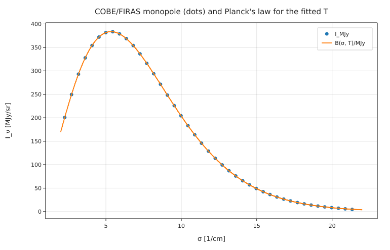
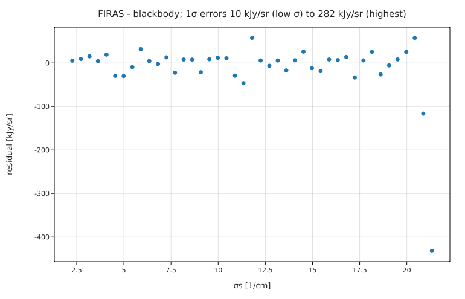

# The CMB blackbody from the COBE/FIRAS spectrum

**Physics.** The cosmic microwave background is the most perfect blackbody known. Its intensity per unit
frequency follows Planck's law, written here with the wavenumber σ = ν/c that FIRAS reports:

I_ν = B(σ, T) = 2 h c σ³ / (e^{hcσ/k_BT} − 1).

Energy released in the early universe (z ≳ 10⁵) would leave a Bose–Einstein spectrum with a chemical potential μ,
B_μ = 2hcσ³/(e^{hcσ/k_BT + μ} − 1). FIRAS limits μ to a few ×10⁻⁵.

**Data.** The FIRAS monopole spectrum: 43 frequencies from 2.27 to 21.33 cm⁻¹ (68 to 639 GHz), with intensity, residual
from a blackbody, 1σ uncertainty and a model of the Galactic emission at the poles (Fixsen et al. 1996, Table 4;
downloaded from NASA LAMBDA, see [SOURCE.md](SOURCE.md)). `prepare.py` writes the same numbers to `firas.csv` with a
Fermium header. Column 2 is a 2.725 K blackbody plus the published residual (Fixsen & Mather 2002 scale).

**Code.** [`firas.fm`](firas.fm):
1. a weighted least-squares fit of T: `fit I / δI = B(σ, T) / δI to data` (dividing both sides by the uncertainty
   makes the unweighted `fit` a χ² fit), and the χ²;
2. a fit of T, μ and the amplitude G₀ of the Galactic spectrum together, as Fixsen et al. do;
3. the peak (`solve peak'(σp) = 0`), the energy and photon number densities by `∫` over the fitted spectrum, and Ω_γ h²;
4. the residuals. Run it from this folder with `fermium run firas.fm` (0.3 s).

## Results

| quantity | Fermium | published | source |
|---|---|---|---|
| T (fit of T alone) | **2.725015 K ± 7.9 μK** (statistical) | 2.725 ± 0.001 K | Fixsen & Mather 2002 (the scale of this file) |
| | | 2.72548 ± 0.00057 K | Fixsen 2009, ApJ 707, 916 (FIRAS recalibrated with WMAP) |
| χ² | 45.1 for 42 degrees of freedom | a good fit | |
| weighted rms residual | 18.9 kJy/sr = **49 ppm** of the 383.5 MJy/sr peak | < 50 ppm of the peak | Fixsen et al. 1996, abstract |
| μ (with T and G₀ free) | **(−1.1 ± 3.6) × 10⁻⁵** | (−1 ± 4) × 10⁻⁵, \|μ\| < 9 × 10⁻⁵ (95 %) | Fixsen et al. 1996 |
| G₀ (Galaxy amplitude) | 0.0006 ± 0.028 | consistent with 0 after their Galaxy subtraction | |
| peak of I_ν | 5.3438 cm⁻¹ = **160.20 GHz** | 160.2 GHz; Wien's law 2.8214 k_BT/h gives 160.20 GHz | |
| photon number density | **410.51 cm⁻³** | 410.7 (T/2.7255 K)³ cm⁻³ = 410.48 cm⁻³ at this T | PDG, Astrophysical constants |
| energy density | 0.26039 eV/cm³ (∫) = 4σT⁴/c | 0.2606 eV/cm³ × (T/2.7255 K)⁴ = 0.2604 | PDG |
| mean photon energy | 2.7012 k_BT | 2.701 k_BT (π⁴/(30 ζ(3))) | |
| Ω_γ h² | **2.471 × 10⁻⁵** | 2.473 × 10⁻⁵ (T/2.7255 K)⁴ = 2.471 × 10⁻⁵ | PDG |

**Honest caveats.** The fitted T is set by the file: column 2 was built as a 2.725 K blackbody plus residuals, so the fit
recovers 2.725 K; the published ±1 mK (and Fixsen 2009's ±0.57 mK) is the absolute-calibration uncertainty, which
the 7.9 μK statistical error does not contain. Our μ fit uses the same Galactic template but not the dipole and
calibration terms of the full analysis, and still lands on the published value and error.

## Friction
- **No jansky and no user-defined units.** Radio astronomy works in Jy (10⁻²⁶ W m⁻² Hz⁻¹); Fermium has neither `Jy`
  nor a way to declare it, so `MJy = 1e-20 W/(m² Hz)` is a variable and the CSV columns are plain numbers
  multiplied by it (the CSV header can't say `[MJy/sr]`). Logged in BACKLOG.md.
- **`fit` does not weight points.** Dividing both sides by the uncertainty works (the left side may be a formula of the
  columns), but a `weights` option would read better.
- The fit report writes `G_0` for the parameter `G₀` (the rest of the program's output keeps the subscript).
- A variable named `s` (the uncertainty) collided with the unit in `100 km/s/Mpc`; the error message said exactly that
  and how to fix it (renamed to `δI`).
