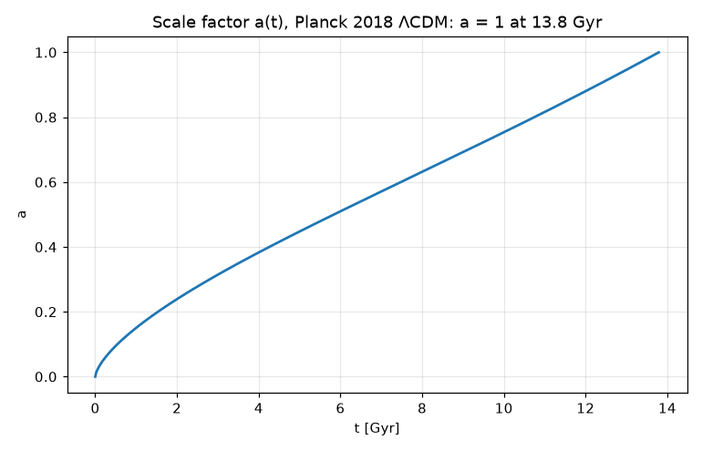

# The age of the universe for Planck 2018 ΛCDM

**Physics.** For a flat universe of radiation, matter and a cosmological constant, the Friedmann equation is

H(a)² = (ȧ/a)² = H₀² (Ω_r/a⁴ + Ω_m/a³ + Ω_Λ),   Ω_Λ = 1 − Ω_m − Ω_r,   a = 1/(1 + z),

so the age is t₀ = ∫₀¹ da/(a H(a)), and the comoving distance to redshift z is D_C = c ∫₀^z dz'/H(z').
Planck Collaboration, *Planck 2018 results VI: Cosmological parameters*, A&A **641**, A6 (2020), Table 2 (base ΛCDM,
TT,TE,EE+lowE+lensing): H₀ = 67.4 km/s/Mpc, Ω_m = 0.315, **age 13.787 ± 0.020 Gyr**, z_eq = 3387 ± 21.
Radiation is computed, not typed: photons at T_CMB = 2.7255 K (ρ_γ c² = 4σT⁴/c) plus neutrinos with N_eff = 3.046.

**Code.** [`friedmann.fm`](friedmann.fm): the age as an integral (`∫ 1 / (a H(a)) da from 0 to 1`), and again by
solving the Friedmann equation as an ODE, `a' = a H(a)`, from the radiation era until `a = 1`. The epochs are
algebraic `solve`s: matter–Λ equality Ω_m(1+z)³ = Ω_Λ, the start of acceleration (q = 0) Ω_m(1+z)³ + 2Ω_r(1+z)⁴ = 2Ω_Λ,
matter–radiation equality. Every quantity carries units (H₀ in km/s/Mpc, ages in Gyr, distances in Mpc and Gly).
Run it from this folder with `fermium run friedmann.fm` (1 s).

## Results

| quantity | Fermium | SciPy `quad`/`brentq` (test) | published |
|---|---|---|---|
| Ω_r (photons + neutrinos) | 9.210×10⁻⁵ | same | (Ω_γ h² = 2.47×10⁻⁵) |
| **age t₀** (integral) | **13.791 Gyr** | 13.791 Gyr | **13.787 ± 0.020 Gyr** (Planck 2018) |
| age t₀ (ODE until a = 1) | 13.791 Gyr | | |
| matter–Λ equality | z = 0.2955 | same | |
| deceleration → acceleration (q = 0) | z = 0.6317, at t = 7.69 Gyr | same | |
| matter–radiation equality | z = 3419 | same | 3387 ± 21 |
| comoving distance to z = 1100 | 13 866 Mpc = 45.23 Gly | same | ≈ 13 870 Mpc (r_*/θ_* from the same Planck table, at z_* = 1090) |
| age at z = 1100 | 365 500 yr | same | ≈ 370 000 yr (commonly quoted) |
| particle horizon today | 46.13 Gly | same | ≈ 46 Gly (commonly quoted) |

- The age agrees with Planck's 13.787 ± 0.020 Gyr to 0.2σ. The remaining 4 Myr is expected: the Planck value is
  computed from the full posterior (H₀ = 67.36, Ω_m = 0.3153, one massive neutrino of 0.06 eV), not from the rounded
  67.4 and 0.315 used here.
- z_eq comes out 3419, 1.5σ above Planck's 3387: Planck's Ω_m includes the 0.06 eV neutrino, which is still
  relativistic at equality. Removing its Ω_ν h² ≈ 0.0006 from the matter gives 3404 (0.8σ; computed by hand, not in
  the program).
- The integral and the ODE give the same age to 5 digits, and both agree with SciPy to 10⁻⁴ (`tests/test_research.py`).

## What writing it in Fermium showed
- H₀ in km/s/Mpc and `1 / H0 in Gyr` just work; the whole calculation is the formulas from the paper.
- **A trap that cost a wrong answer:** `∫ … da from 0 to 1 / (1 + zq)` divides the *whole integral* by (1 + zq), as
  §9 of the reference says (a `/` with a space before it ends the upper limit). There is a warning when the divisor
  is a plain number or name (`to L / 2`), but **none for a bracketed divisor**, so the first version printed the
  age at z = 1100 as 12.5 Myr instead of 366 000 yr, silently. Writing `to (1 / (1 + zq))` fixes it. This one should
  warn too (checked: `∫ 1 / (1 + x) dx from 0 to 1 / (1 + z)` prints ln 2/(1 + z) with no warning).
- `7/8 (4/11)^(4/3) N_eff` is 7/(8 …): Fermium warned, which caught a real mistake (Ω_r was 25 % too large).
