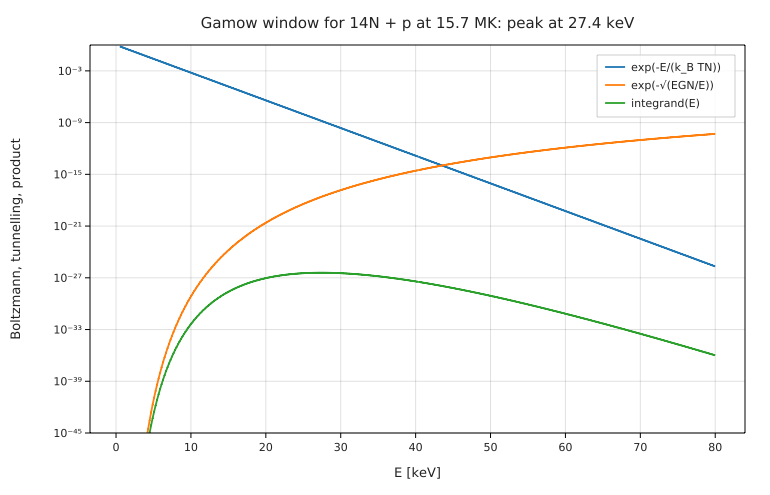
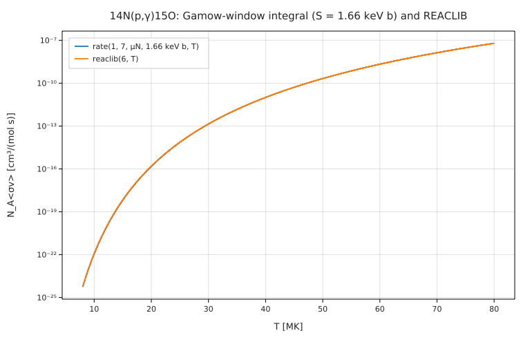

# The Gamow window of key stellar reactions, against JINA REACLIB

**Physics.** Two nuclei with charges Z₁, Z₂ fuse in a star only by tunnelling through their Coulomb barrier. The cross
section is written σ(E) = S(E) e^{−√(E_G/E)}/E, with the Gamow energy E_G = 2μc²(παZ₁Z₂)² and a slowly varying
S-factor. Averaging over the Maxwell–Boltzmann distribution gives the thermonuclear rate

N_A⟨σv⟩ = N_A √(8/(πμ)) (k_BT)^(−3/2) ∫ S(E) e^{−E/k_BT − √(E_G/E)} dE.

The integrand is the product of a falling Boltzmann factor and a rising tunnelling factor: a narrow peak, the
**Gamow window**, at E₀ = (√E_G k_BT/2)^(2/3) with 1/e width Δ = 4√(E₀k_BT/3). Replacing it by a Gaussian gives the
closed form N_A⟨σv⟩ ≈ N_A √(2/μ) Δ S(E₀) e^{−3E₀/k_BT}/(k_BT)^(3/2) (Clayton, *Principles of Stellar Evolution and
Nucleosynthesis*; Rolfs & Rodney, *Cauldrons in the Cosmos*, ch. 4).

**Data.** Rate fits from the JINA REACLIB database (Cyburt et al. 2010; snapshot 2025-03-30), nuclear masses from AME2020,
and S-factors from *Solar Fusion II* (Adelberger et al. 2011) and deBoer et al. (2017) for ¹²C(α,γ)¹⁶O. REACLIB's web site
refuses scripted downloads, so the snapshot comes from the copy in pynucastro's PyPI wheel; see [SOURCE.md](SOURCE.md).
`prepare.py` extracts the 14 fit sets and 6 masses used (raw lines kept in `reaclib_excerpt.txt` and `ame2020_excerpt.txt`).

**Code.** [`gamow.fm`](gamow.fm) evaluates the REACLIB fits (`reaclib(k, T)`, a sum of seven-parameter exponentials, with
T₉ = T/1 GK), and for each reaction computes E_G, E₀, Δ, the rate by `∫` with a constant S and the Gaussian closed form,
all with units (`E_G(Z₁, Z₂, μ) = 2 μ c² (π α Z₁ Z₂)²` is in joules; `S0 = [...] keV b`). It then finds the peak of the
¹⁴N + p integrand with `solve integrand'(Ep) = 0` and its 1/e points, and compares the ¹⁴N(p,γ) rate with REACLIB from
10 to 60 MK. Run it from this folder with `fermium run gamow.fm` (0.4 s).

## Results

Solar-core temperature 15.7 MK (¹²C(α,γ) at 0.2 GK, helium burning):

| reaction | E₀ | Δ | τ = 3E₀/kT | N_A⟨σv⟩, ∫ with S const [cm³/(mol s)] | REACLIB | ratio |
|---|---|---|---|---|---|---|
| p(p,e⁺ν)d | 6.088 keV | 6.628 keV | 13.50 | 8.893 × 10⁻²⁰ | 9.700 × 10⁻²⁰ | **0.917** |
| ³He(³He,2p)⁴He | 22.11 keV | 12.63 keV | 49.02 | 4.648 × 10⁻¹⁰ | 4.560 × 10⁻¹⁰ | **1.02** |
| ³He(α,γ)⁷Be | 23.10 keV | 12.91 keV | 51.22 | 5.309 × 10⁻¹⁵ | 5.336 × 10⁻¹⁵ | **0.995** |
| ⁷Be(p,γ)⁸B | 18.48 keV | 11.55 keV | 40.98 | 6.896 × 10⁻¹² | 6.635 × 10⁻¹² | **1.04** |
| ¹²C(p,γ)¹³N | 24.66 keV | 13.34 keV | 54.67 | 5.662 × 10⁻¹⁶ | 8.062 × 10⁻¹⁶ | **0.70** |
| ¹⁴N(p,γ)¹⁵O | 27.43 keV | 14.07 keV | 60.82 | 1.580 × 10⁻¹⁸ | 1.699 × 10⁻¹⁸ | **0.930** |
| ¹²C(α,γ)¹⁶O (0.2 GK) | 315.5 keV | 170.3 keV | 54.93 | 7.180 × 10⁻¹⁵ | 7.079 × 10⁻¹⁵ | **1.01** |

| check | Fermium | published / expected |
|---|---|---|
| p+p Gamow peak at 15 MK | 6.09 keV at 15.7 MK (5.89 keV at 15 MK by E₀ ∝ T^(2/3)) | 5.9 keV (textbook value, e.g. Rolfs & Rodney) |
| ¹²C(α,γ) Gamow peak at 0.2 GK | 315 keV | "≈ 300 keV", the energy at which S is quoted (deBoer et al. 2017) |
| ¹⁴N + p peak: `solve integrand' = 0` vs formula | 27.426 keV vs 27.426 keV | identical (E₀ is exact for the exponent) |
| ¹⁴N + p 1/e points | 21.11 and 35.24 keV (width 14.13 keV) | Gaussian E₀ ± Δ/2: 20.39 and 34.46 keV (width 14.07 keV): the real window is skewed to higher E |
| ∫ vs Gaussian closed form | the closed form is 0.7–3 % low | the known correction 1 + 5/(12τ) (Rolfs & Rodney): 3.1 % for pp, 0.7 % for ¹⁴N + p |
| ¹⁴N(p,γ) ∫ / REACLIB, 10 → 60 MK | 0.902, 0.930, 0.946, 0.973, 0.992, 1.01 | |

**Honest reading.** Five of seven rates agree with REACLIB to 5 % or better with nothing but a constant S(0) and the
Gamow integral. The differences are physics the constant-S model leaves out: S(E) rises with energy for p + p
(S′/S ≈ 11 MeV⁻¹ in Solar Fusion II, +7 % at E₀ ≈ 6 keV, the size of our 8 % deficit) and the REACLIB ¹⁴N(p,γ) fit
(Imbriani et al. 2005) includes resonance terms that matter more at low T, hence the ratio drifting from 0.90 to 1.01.
¹²C(p,γ) is 30 % low: the REACLIB `ls09` fit is not built on the Solar Fusion II S(0) = 1.34 keV b, and includes the
tail of the resonance at E_p = 0.46 MeV (lab); we did not track down its S(0). The Gamow-peak numbers are exact consequences of the
formulas; the "published" peak values are the round numbers textbooks quote.

## Friction
- A variable named `s` (a running sum) collided with the unit in `1 cm³/(mol s)`. The error was right, but its hint
  printed the bracketed unit without its closing parenthesis: `1 [cm³/(mol s]` (reported in BACKLOG.md).
- `where` is not accepted after a `solve … for x from a to b` line (the plain expression works).
- REACLIB's own site cannot be scripted (bot protection); the data had to come from a mirror in a Python package.
