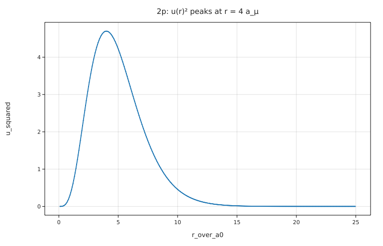

# Hydrogen energy levels from the radial Schrödinger equation

**Physics.** With ψ = (u(r)/r) Y_lm, the Schrödinger equation for the hydrogen atom reduces to

u'' = [ l(l+1)/r² − (2μ/ħ²) (E + e²/(4πε₀ r)) ] u,   u(0) = 0,  u → 0 as r → ∞,

where μ = m_e m_p/(m_e + m_p) is the reduced mass (the proton moves too). Bound states exist only at the Bohr
energies E_n = −Ry (μ/m_e)/n², with Ry = m_e e⁴/(32π²ε₀²ħ²) = 13.605693 eV, and all l = 0 … n−1 are degenerate.
The 2p → 1s photon is Lyman α, measured at **121.567 nm** (NIST Atomic Spectra Database, vacuum wavelength).

**Code.** [`hydrogen.fm`](hydrogen.fm) finds the eigenvalues by *shooting*: `shoot(E, l)` integrates outward from
r₀ = 10⁻⁶ a₀ (series start u ≈ r^(l+1)(1 − r/((l+1)a_μ))) to r_max = 2 r_turning + 25 decay lengths, and returns
u(r_max), which flips from +∞ to −∞ across each eigenvalue. For each l, E is scanned upward from −14 eV in 3 % steps
and every sign change is refined with `solve shoot(E, l) = 0 for E from E_lo to E_hi`. No energy is put in by hand:
the scan finds the levels. The Bohr formula is only used for comparison. Units are checked throughout (E in eV,
r in m, u dimensionless). Runs in about 1.5 s. Run it from this folder with `fermium run hydrogen.fm`.

## Results

| n | l | E (Fermium shooting) | −13.605693 eV (μ/m_e)/n² |
|---|---|---|---|
| 1 | 0 | −13.5982873 eV | −13.5982871 eV |
| 2 | 0, 1 | −3.39957182 eV (both) | −3.39957179 eV |
| 3 | 0, 1, 2 | −1.51092081 eV (all three) | −1.51092079 eV |
| 4 | 0, 1, 2, 3 | −0.849892954 eV (all four) | −0.849892946 eV |

- All 10 states agree with Bohr to 9×10⁻⁹ (relative), and the l-degeneracy comes out to all 9 printed digits.
- **Lyman α:** hc/(E_2p − E_1s) = **121.5684 nm**, against the measured **121.567 nm** (NIST): a difference of
  1.1×10⁻⁵, which is the size of the fine-structure and Lamb-shift corrections that the Schrödinger equation leaves
  out (α² ≈ 5×10⁻⁵). Without the reduced mass the answer would be 121.5023 nm, 5×10⁻⁴ off: the measurement clearly
  sees the proton's recoil.
- The 2p wavefunction: `solve u'(r_peak) = 0 …` on the solution puts the maximum of u² at 4.00218 a₀ = 4 a_μ, as exact.

## What writing it in Fermium showed
- The shooting method is short: a function with a `solve` inside returns `u[end]`, and the algebraic `solve` root-finds
  on it directly, even though each evaluation is a whole ODE solve (the program runs in 1.5 s).
- `in a_0` is refused ("'a_0' is not a unit Fermium knows"): constants can't be used as display units, so `plot … vs
  r in a_0` needs a hand-made list of r/a₀. Atomic units (`units atomic`, or `in a_0`, `in Ry`) would help here.
- An ODE solution can't be called with a list (`u(rs)` is "this value must be a number, but it is a list"), unlike a
  function (§5 of the reference), so the plot lists are built with a loop and `push`.
- Plot axis labels are the list names (`u_squared`, `r_over_a0`).
- The Rydberg energy had to be typed (13.605693 eV) for the comparison, or computed as `m_e e⁴/(32π² ε₀² ħ²)`; `R_∞`
  exists but is a wavenumber, so `R_∞ h c` is needed; that works, but a `Ry` constant would be friendlier.
