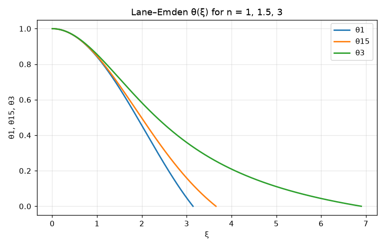

# Lane–Emden polytropes and the Chandrasekhar mass

**Physics.** A star whose pressure depends only on density, P = K ρ^(1 + 1/n) (a *polytrope* of index n), in
hydrostatic equilibrium obeys, with ρ = ρ_c θⁿ and r = a ξ, the Lane–Emden equation

θ'' + (2/ξ) θ' + θⁿ = 0,   θ(0) = 1, θ'(0) = 0,   a² = (n + 1) K ρ_c^(1/n − 1) / (4πG).

The surface is the first zero ξ₁ of θ, and the mass is M = 4π a³ ρ_c ω_n with ω_n = −ξ₁² θ'(ξ₁). These two numbers
were tabulated by S. Chandrasekhar, *An Introduction to the Study of Stellar Structure* (1939), Table 4.

A white dwarf is held up by degenerate electrons. When they are ultra-relativistic, P = K ρ^(4/3) with
K = (ħc/4)(3π²)^(1/3)/(μ_e m_u)^(4/3): an n = 3 polytrope. Then the central density drops out of the mass,

M_Ch = 4π ω₃ (K/(πG))^(3/2) = (√(3π)/2) ω₃ (ħc/G)^(3/2) / (μ_e m_u)²,

a single mass, the **Chandrasekhar limit** (S. Chandrasekhar, *ApJ* **74**, 81 (1931); *MNRAS* **95**, 207 (1935)):
no white dwarf can be heavier.

**Code.** [`lane_emden.fm`](lane_emden.fm) solves the equation for n = 1, 1.5 and 3, starting at ξ₀ = 10⁻⁵ with the
series θ ≈ 1 − ξ²/6 + n ξ⁴/120 (the 2/ξ term is 0/0 at the centre), and stops at the surface with `until θ = 0`
(tolerance 10⁻¹²). ω_n = −ξ₁² θ'(ξ₁) uses the solution's derivative `θ'(ξ₁)`. The Chandrasekhar mass is then one line
with units, `4π ω3 ((ħ c / 4) (3π²)^(1/3) / ((μ_e m_u)^(4/3) π G))^(3/2)`, printed in M☉.

## Results

| n | ξ₁ (Fermium) | Chandrasekhar 1939 | −ξ₁²θ'(ξ₁) (Fermium) | Chandrasekhar 1939 | ρ_c/ρ̄ |
|---|---|---|---|---|---|
| 1 | 3.141593 | π = 3.14159 | 3.141593 | π = 3.14159 | 3.2899 |
| 1.5 | 3.653754 | 3.65375 | 2.714055 | 2.71406 | 5.9907 |
| 3 | 6.896849 | 6.89685 | 2.018236 | 2.01824 | 54.182 |

All six agree with the table to its last digit, and with an independent SciPy `solve_ivp` (rtol 10⁻¹²) to 10⁻⁶
(`tests/test_research.py`).

| Chandrasekhar mass | Fermium | published |
|---|---|---|
| M_Ch μ_e² (nucleon mass m_u) | **5.825 M☉** | 5.83 M☉ (the standard textbook value, e.g. Shapiro & Teukolsky 1983) |
| μ_e = 2 (He, C/O white dwarf) | **1.456 M☉** | 1.46 M☉ with m_u |
| with m_H = m_p + m_e, μ_e = 2 | **1.434 M☉** (5.735/μ_e²) | the often-quoted 1.44 M☉ (≈ 5.7/μ_e², the hydrogen-atom mass per nucleon) |
| μ_e = 56/26 (iron core) | 1.256 M☉ | |

- The textbook formula value is reproduced; the often-quoted 1.44 M☉ matches the same formula with the hydrogen-atom mass as the
  mass per nucleon. Which one the number "1.44" means depends on the book; both are shown so the 1.5 % difference is
  not mistaken for an error. (Real white dwarfs become unstable a little below either number, through inverse β decay
  and general relativity, which this model leaves out.)
- An n = 3/2 white dwarf (non-relativistic electrons) of 0.6 M☉ has R = 10 500 km and ρ_c = 1.46×10⁶ g/cm³ (closed form
  checked in the test). The observed radius of such a star, ~8 700 km, is smaller because its electrons are already
  partly relativistic.

## What writing it in Fermium showed
- `until θ = 0` replaced the hand-written bisection of `examples/13_lane_emden.fm`; the answers are good to 7 digits.
- Fractional powers of quantities with units work: `ρc^(-1/6)` of a density, `(K/(πG))^(3/2)`, and the result is
  a mass in M☉ with no conversion factors written by hand.
- Three polytropes needed three copies of the `solve` block (θ1, θ15, θ3): a solution can't be returned from a
  function or kept in a list, so a loop over n can compute the numbers but not keep the curves for the plot.
- The plot legend shows the variable names θ1, θ15, θ3; there is no way to label a series ("n = 1.5").
- `sign(θ) abs(θ)^1.5` is needed so that a trial step past the surface does not give NaN (same as the TOV program).
