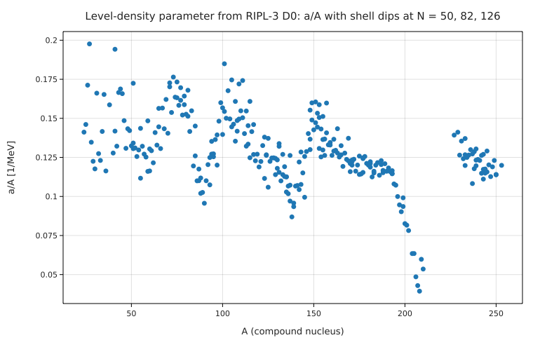

# The nuclear level density from neutron resonance spacings (RIPL-3)

**Physics.** When a slow neutron is captured, the compound nucleus is left at an excitation equal to the neutron binding
energy B_n (5–11 MeV), where its levels are dense: the resonances seen in the neutron cross section are spaced by D₀,
from eV in heavy nuclei to hundreds of keV in light ones. Bethe (1936) treated the nucleons as a Fermi gas: at excitation U
the level density is

ρ(U) = √π e^{2√(aU)} / (12 a^(1/4) U^(5/4)),   ρ(U, J, π) = ½ ρ(U) (2J + 1)/(2√(2π) σ³) e^{−(J+½)²/(2σ²)},

with spin cut-off σ² = 0.0888 √(aU) A^(2/3) (Gilbert & Cameron 1965), U = B_n − δ (δ = 12 MeV/√A for each even kind of
nucleon), and s-wave neutrons on a target of spin I₀ reaching J = I₀ ± ½: 1/D₀ = Σ_J ρ(U, J, π). For a gas of free nucleons
a = (π²/4ε_F) A; the empirical level-density parameter is closer to a ≈ A/8 MeV⁻¹, with deep minima at closed shells.

**Data.** The RIPL-3 table of s-wave resonance parameters (IAEA; Capote et al. 2009): D₀ for 300 targets from ²³Na to ²⁵²Cf,
spanning 6.25 decades (see [SOURCE.md](SOURCE.md)).

**Code.** [`level_density.fm`](level_density.fm) writes the Fermi-gas formulas as functions with units (a in MeV⁻¹, U in MeV,
ρ in MeV⁻¹), finds each nucleus's a with `solve inv_D0(U, a_i, Ac, I0) = 1/D0 for a_i from 1 /MeV to 60 /MeV`, fits a = A/k, computes
the free-Fermi-gas value from the nuclear density, and predicts all 300 spacings with the single fitted k. Run it from this
folder with `fermium run level_density.fm` (0.2 s).

## Results

| quantity | Fermium | published / expected | source |
|---|---|---|---|
| a = A/k fitted to 300 nuclei | **k = 8.27 ± 0.09 MeV** (median A/a = 7.90 MeV) | a ≈ A/8 MeV⁻¹ | Gilbert & Cameron 1965; the textbook systematics |
| free Fermi gas, n₀ = 0.16 fm⁻³ | ε_F = 36.8 MeV, a = A/(14.9 MeV) | a = π²A/(4ε_F) ≈ A/15 MeV⁻¹ | Bohr & Mottelson; the real a is twice as large (effective mass, surface) |
| ²⁰⁸Pb (Z = 82, N = 126) | A/a = **25.4 MeV** | the deepest shell minimum | |
| ¹³⁸Ba (N = 82), ⁸⁸Sr (N = 50) | A/a = 11.5, 9.81 MeV | shell minima | |
| mid-shell ¹⁶⁴Dy, ¹⁶⁸Er, ²³⁹U | A/a = 7.98, 8.08, 7.67 MeV | close to A/8 | |
| D₀ predicted with a = A/8.27 MeV, all 300 | log₁₀(D₀,pred/D₀,meas) mean +0.13, scatter **0.73 decades** | | over 6.25 decades of D₀ |

**Honest reading.** One parameter, k ≈ 8 MeV, predicts the level spacing of 300 nuclei to within a factor ~5 (0.73 decades)
over six decades, and the parameter matches the classic systematics. The misses are the shell effects: near ²⁰⁸Pb, a is three
times smaller than A/8, as the plot shows (dips at A ≈ 90, 140 and 208). The Gilbert–Cameron and back-shifted Fermi-gas
formulas in RIPL add shell corrections (Ignatyuk's energy-dependent a) and better pairing shifts; this program uses the
simplest form, so its individual a values are not the RIPL-3 recommended ones.

## Friction
- **A wrong standard error from `fit` (found here, a silent wrong answer, also in Fermium 1.5):** fitting a parameter whose
  SI value is tiny, `k = 8 MeV` (1.3 × 10⁻¹² J) in `fit a = A / k`, reports `k = 1.273×10⁻¹² J (standard error
  1.7×10⁻¹⁰ J)`, 100 times the value; the same fit with a plain parameter (`fit a * 1 MeV = A / k`) gives the right
  7.948 ± 0.089. The fitted value is right; only the error (and so `err(k)`) is wrong. The report is also in J, not in the MeV
  of the starting value. Logged under "Bugs first" in BACKLOG.md with a five-line reproduction.
- `σ²(U, a, A) = …` can't be a function name (the superscript is read as a power); written `σsq`.
- A spin `J` collided with the unit joule in `2J` (clear error; renamed `spin`).
- `(2J + 1) / (…) exp(…)` was refused as ambiguous (division then implicit multiplication), with a hint giving both
  readings; `* exp(…)` fixed it. Good error.
