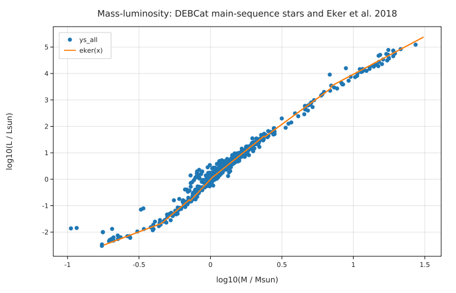

# The main-sequence mass–luminosity relation from eclipsing binaries

**Physics.** Detached eclipsing binaries give the only direct, model-free masses and radii of stars (from the orbit and the
eclipse light curve); with the effective temperature, L = 4πR²σT⁴. On the main sequence L rises steeply with mass: homology
arguments give L ∝ μ⁴M³/κ, and the classic textbook power law is L ∝ M^3.5. Eker et al. (2018) found that 509 main-sequence
components are best described by six power laws log L = α log M + β with breaks at 0.45, 0.72, 1.05, 2.4 and 7 M☉.

**Data.** DEBCat (Southworth 2015): 388 well-studied detached eclipsing binaries with masses and radii mostly to 2 %,
downloaded from Keele (see [SOURCE.md](SOURCE.md)). `prepare.py` writes one row per star (774 stars).

**Code.** [`mlr.fm`](mlr.fm) turns the catalogue's logarithms into quantities with units (`10^logR * R☉`,
`10^logT * 1 K`), computes L = 4πR²σT⁴, checks the solar normalisation (4πR☉²σ(5772 K)⁴/L☉ = 1.0000 with the IAU 2015
nominal values), selects main-sequence stars (log g ≥ 3.9), fits a power law in each of Eker's mass ranges and one over all
masses, and measures the scatter of the data about Eker's relation. Run it from this folder with `fermium run mlr.fm` (0.15 s).

## Results

| mass range [M☉] | N | α (Fermium, DEBCat) | α (Eker et al. 2018) | β (Fermium) | β (Eker) | scatter [dex] |
|---|---|---|---|---|---|---|
| 0.179–0.45 | 27 | 1.81 ± 0.36 | **2.028 ± 0.135** | −0.98 ± 0.19 | −0.976 | 0.24 |
| 0.45–0.72 | 50 | 5.02 ± 0.47 | **4.572 ± 0.319** | +0.04 ± 0.10 | −0.102 | 0.16 |
| 0.72–1.05 | 101 | 3.90 ± 0.51 | **5.743 ± 0.413** | +0.061 ± 0.037 | −0.007 | 0.25 |
| 1.05–2.40 | 312 | 3.993 ± 0.072 | **4.329 ± 0.087** | +0.080 ± 0.013 | +0.010 | 0.12 |
| 2.4–7 | 38 | 4.08 ± 0.16 | **3.967 ± 0.143** | +0.00 ± 0.10 | +0.093 | 0.14 |
| 7–31 | 42 | 3.00 ± 0.14 | **2.865 ± 0.155** | +0.91 ± 0.16 | +1.105 | 0.12 |
| one power law, all 576 | | 3.786 ± 0.025 | 3.5 (textbook) | | | 0.23 |

| check | Fermium | expected |
|---|---|---|
| 4πR²σT⁴ vs the catalogue's log L (625 stars) | mean −0.0006 dex, std 0.020 dex | the catalogue's L comes from the same R and T; the 0.02 dex is authors' different L☉ and rounding |
| 4πR☉²σ(5772 K)⁴/L☉ | 1.0000 | 1 (IAU 2015 B3 nominal values) |
| DEBCat main-sequence stars − Eker relation (570) | mean +0.042 dex, rms 0.18 dex | |

**Honest reading.** Four of the six slopes agree with Eker et al. within about 1.5σ (combined errors), and the relation
describes the whole DEBCat main sequence with a 0.18 dex rms. Two ranges disagree: 0.72–1.05 M☉ (α = 3.9 vs 5.7, 2.8σ) and
1.05–2.4 M☉ (4.0 vs 4.3, 3σ). Our selection is only a surface-gravity cut; DEBCat includes slightly evolved solar-type
components and magnetically active, inflated K dwarfs (the points above the line near 1 M☉ in the plot), which Eker et al.
removed with a stricter main-sequence selection and their own data set (509 stars, partly different). A stricter cut
(log g ≥ 4.1) leaves the 0.72–1.05 slope at 3.8, so the difference is in the samples, not the cut.

## Friction
- Each of the six fits prints its own report (seven reports in all); there is no way to fit quietly and print only the
  table the program writes. Logged in BACKLOG.md.
- Elements of a list literal lose the digits they were written with (`edges[k]` for 0.179 printed `0.18`, 1.05 printed `1.1`);
  `to 3 digits` fixes it.
- The catalogue gives logarithms; `10^logR * R☉` in a loop builds the lists with units, since `10^list` isn't element-wise.
