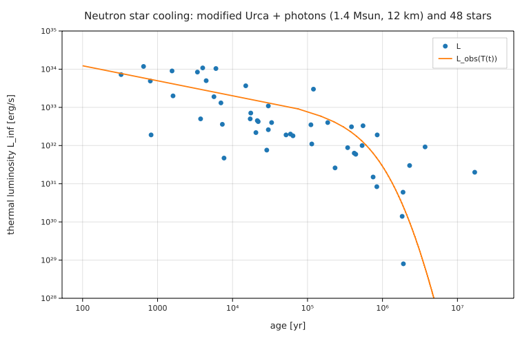

# Neutron star cooling against 48 thermally emitting neutron stars

**Physics.** A neutron star is born at ~10¹¹ K and cools first by neutrinos from its core, then, after ~10⁵ yr, by photons from
its surface. In the simplest ("standard") picture:

- heat capacity of the degenerate neutrons, C = (π²/2) N k_B (k_BT/E_F) = C₉ T₉;
- neutrino luminosity from the modified Urca process, neutron branch, n + n → n + p + e + ν̄ (and inverse), L_ν = N₉ T₉⁸
  (emissivity 8.1 × 10²¹ (n_p/n₀)^(1/3) T₉⁸ erg cm⁻³ s⁻¹ with bare nucleon masses and α_nβ_n ≈ 1; Friman & Maxwell 1979,
  Yakovlev et al. 2001, Phys. Rep. 354, 1), with the proton density from a proton fraction x_p = 0.05;
- photons through the heat-blanketing envelope, T_s = 0.87 × 10⁶ K g₁₄^(1/4) (T_b/10⁸ K)^0.55 (Gudmundsson, Pethick &
  Epstein 1983), L = 4πR²σT_s⁴, redshifted to L∞ = (1 − r_g/R) L for a distant observer;
- C dT/dt = −(L_ν + L_γ). In the neutrino era this has the closed form T₉ = (C₉/(6N₉t))^(1/6).

Stars much colder than this curve need faster neutrino emission (direct Urca, pion or kaon condensates, or superfluid
pair breaking); stars much hotter need heating (magnetic-field decay) or are younger than their spin-down age.

**Data.** The Ioffe compilation of thermally emitting neutron stars (Potekhin et al. 2020, updated online), downloaded
as HTML (see [SOURCE.md](SOURCE.md)): 48 stars with measured thermal luminosities in four groups — 12 weakly magnetised
(CCO-like), 22 ordinary pulsars, 6 high-B pulsars, and 8 "Magnificent Seven" isolated neutron stars. The age is the
independent age t* where known (25 stars), otherwise the characteristic age P/2Ṗ, as in the table.

**Code.** [`ns_cooling.fm`](ns_cooling.fm) computes C₉ and N₉ for a 1.4 M☉, 12 km star from the constants (the neutron
Fermi energy at the mean density), solves the cooling equation with `radau` from 1 yr to 3 × 10⁷ yr, checks it against the
closed form, finds when photons overtake neutrinos (`solve L_ν(T(tx)) = L_γ(T(tx))`), and compares every star with the
model at its age. Run it from this folder with `fermium run ns_cooling.fm` (0.2 s).

## Results

| quantity | Fermium | expected / published |
|---|---|---|
| C₉ (degenerate neutrons, 1.4 M☉, 12 km) | 1.31 × 10³⁹ erg/K | ~10³⁹ erg/K (the usual order of magnitude) |
| N₉ (modified Urca) | 2.44 × 10⁴⁰ erg/s | ~10⁴⁰ erg/s |
| T(100 yr), T(1000 yr) | 3.91 × 10⁸ K, 2.65 × 10⁸ K | closed form 3.76 × 10⁸, 2.56 × 10⁸ K (3.7 % apart: photons already carry some heat) |
| photons overtake neutrinos | t = 6.0 × 10⁴ yr (T_core = 1.3 × 10⁸ K) | "after ~10⁵ yr" (textbook) |
| L∞ at 10³, 10⁴, 10⁵, 10⁶ yr | 5.3 × 10³³, 2.2 × 10³³, 7.7 × 10³², 2.9 × 10³¹ erg/s | |
| Cas A (326 yr) | model 7.95 × 10³³, observed 7.2 × 10³³ erg/s (5.6–9.3) | consistent |
| 3C 58 / PSR J0205+6449 (820 yr) | model 5.7 × 10³³, observed **1.9 × 10³²** erg/s: 30 × colder | too cold for standard cooling (Slane, Helfand & Murray 2002) |
| PSR B2334+61 (7700 yr) | observed 52 × below the model | also too cold |
| Vela (22 kyr) | observed 0.26 × the model | |
| all 48 | 31 within a factor 3 of their error range; median log₁₀(L_obs/L_model) = −0.33 | |
| ordinary pulsars (22) | mean log₁₀ ratio −0.69 (colder than the model) | |
| CCO-like (12), high-B (6) | −0.01, −0.19 | |
| XINSs (8, mostly with characteristic ages) | +1.62 (much hotter) | spin-down ages overestimate the age, and field decay heats them |
| stars with an independent age t* | 11 of 25 within a factor 3 | |

**Honest reading.** A one-zone model with textbook physics and no free parameter follows the observed luminosities over
five decades of age: a factor ~2 in the median (the model is brighter), and 31 of 48 stars within a factor 3. The famous outliers come out where
they should: 3C 58 and B2334+61 are an order of magnitude too cold (enhanced cooling), and the Magnificent Seven are far too
hot for their characteristic ages. What the model leaves out is large: nucleon superfluidity (which both suppresses the
Urca processes and adds pair-breaking neutrinos), the effective masses, the proton fraction (x_p = 0.05 is assumed; N₉ ∝ x_p^(1/3)), the modified Urca proton branch, the real density profile (a mean density of
0.23 fm⁻³ is used everywhere), light-element envelopes (which make stars brighter at the same core temperature), and
direct Urca in heavy stars. The comparison is with the data, not with Potekhin et al.'s theoretical curves.

## Friction
- The ODE ran in `radau` over 7.5 decades of time with no trouble; `T(ns.t[i])` evaluates the solution at each star's age.
- A plot range on a log axis needed its unit (`y from 1e28 erg/s to 1e35 erg/s`), which is right, and worked.
- (No new frictions beyond those logged for the other reproductions.)
