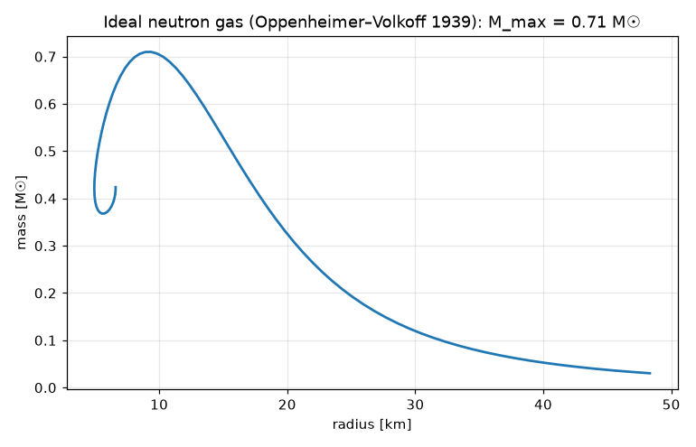
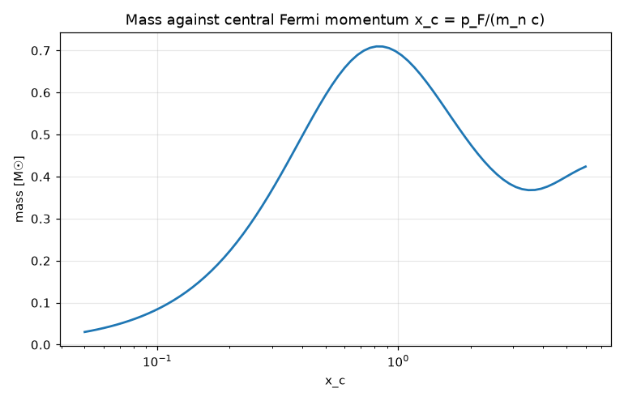

# Neutron stars from the Tolman–Oppenheimer–Volkoff equation (Oppenheimer & Volkoff 1939)

**Physics.** A static, spherical star in general relativity obeys the TOV equation

dP/dr = −G (ε + P)(m + 4π r³ P/c²) / (c² r² (1 − 2Gm/(rc²))),   dm/dr = 4π r² ε/c²

with ε the total energy density (rest mass included) and m(r) the gravitational mass inside r. J.R. Oppenheimer and
G.M. Volkoff, *Phys. Rev.* **55**, 374 (1939), closed it with the simplest equation of state: a cold, ideal
(non-interacting) Fermi gas of neutrons. With the Fermi momentum x = p_F/(m_n c) as parameter,

ε = K_n [(2x³ + x)√(1 + x²) − asinh x],   P = (K_n/3) [(2x³ − 3x)√(1 + x²) + 3 asinh x],   K_n = m_n⁴c⁵/(8π²ħ³).

They found that such stars have a **maximum mass of about 0.71 M☉** (at R ≈ 9.6 km in their paper): above it,
the added pressure itself gravitates and no static star exists. Real neutron stars (up to ~2 M☉) exist only
because the nuclear force stiffens the equation of state.

**Code.** [`tov.fm`](tov.fm) integrates outward from r = 1 m for each central Fermi momentum x_c. Instead of P it
integrates y = x² (with dP/dr = P'(x) dx/dr): y falls linearly to zero at the surface, where P and dP/dx vanish, so
`until y = 0` stops exactly at the radius. The star is a function `star(xc)` that returns `<M, R>` (a vector
with a unit per component). 80 central densities give the M–R curve, and a golden-section search on `star(xc).x`
refines the maximum. The whole program runs in about 2 s. Run it from this folder with `fermium run tov.fm`.

## Results

| quantity | Fermium | SciPy `solve_ivp` (same EOS, rtol 10⁻¹⁰) | Oppenheimer & Volkoff (1939) |
|---|---|---|---|
| maximum mass | **0.7102 M☉** | 0.7102 M☉ | 0.71 M☉ |
| radius at maximum mass | **9.161 km** | 9.161 km | 9.6 km |
| central Fermi momentum x_c | 0.834 | 0.834 | — |
| central density (rest mass, n m_n) | 3.54×10¹⁵ g/cm³ | 3.54×10¹⁵ g/cm³ | — |
| compactness 2GM/(Rc²) | 0.229 | | |

Points on the curve (Fermium, agree with SciPy to 10⁻³, checked in `tests/test_research.py`):

| x_c | 0.2 | 0.5 | 1.0 | 2.0 |
|---|---|---|---|---|
| M (M☉) | 0.2228 | 0.5942 | 0.6947 | 0.4763 |
| R (km) | 23.63 | 13.51 | 7.913 | 5.081 |

- The maximum mass reproduces the published 0.71 M☉. The radius at the maximum comes out 9.16 km, 5 % below the
  9.6 km quoted in the 1939 paper; the independent SciPy integration gives the same 9.16 km, so the difference is in
  the 1939 numbers (computed without electronic computers), not in the two programs. The maximum is flat in x_c,
  so the mass is much less sensitive to such differences than the radius.
- **Newtonian check.** At low density the gas is a non-relativistic n = 3/2 polytrope, for which M R³ is a constant:
  4π ω₁ ξ₁³ (5K/(8πG))³ = 3451 M☉ km³ with K = (3π²)^(2/3) ħ²/(5 m_n^(8/3)). The program gives 3420 and 3380 M☉ km³ at
  x_c = 0.05 and 0.07 (the 1–2 % shortfall is the relativistic softening of the gas and GR, growing with x_c).
- Past the maximum the curve spirals (the unstable branch), as in every textbook figure of this model.

## What writing it in Fermium showed
- The TOV equation reads as on paper, units checked everywhere (ε in Pa, m in kg, r in m); `until y = 0` found the
  surface without any bisection code, and `solve` inside a function called 250 times is fast (2 s in total).
- Returning two results from a function needed a mixed-unit vector `<m[end], times(m)[end]>`; it works, but
  `s.x` for a mass and `s.y` for a radius read poorly. Named results (or tuples) would be clearer.
- `asinh` works but is not listed among the built-in functions in docs/reference.md §13.
- `K` as a variable name collides with the kelvin in `8 K x⁴` (an error, correctly), so the constant is `K_n`.
- A unit can't stand alone in a formula: `lo.x lo.y³ / (M☉ km³)` is an error ("km isn't defined"); the fix is
  `… in M☉ km³` or `(1 M☉ km³)`.
- Plot axes are labelled with the list variable names; there is no option to set an axis label, so the lists
  are named `mass`, `radius`, `x_c` to make the labels readable.
- `plot a vs b, title "…"` is a parse error ("expected 'vs'"): the options need `with` before them. Correct per
  the reference, but the message could say so.
- A `√(abs(y))` guard is needed so that a trial step past the surface does not give NaN; Fermium has no way to say
  "the equation is only defined for y ≥ 0".
