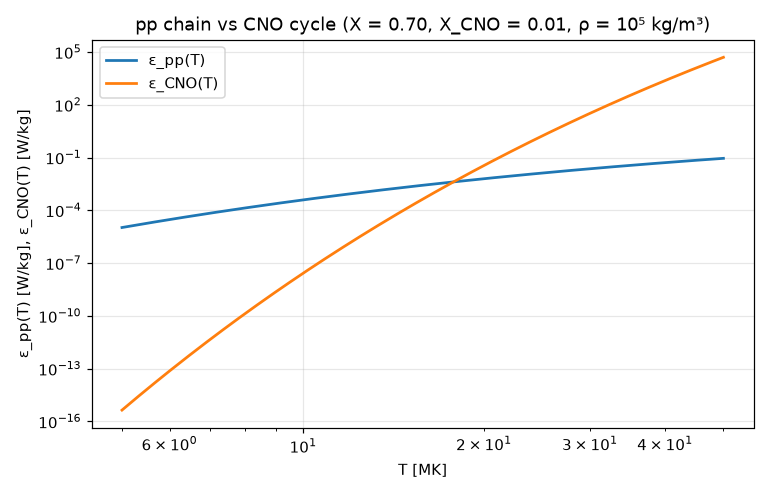

# pp chain versus CNO cycle: the crossover temperature

**Physics.** Main-sequence stars burn hydrogen to helium in two ways. The **pp chain** starts with p + p → d e⁺ ν,
whose Coulomb barrier between two single charges is low; the **CNO cycle** uses carbon, nitrogen and oxygen as
catalysts, and its slowest step, ¹⁴N(p, γ)¹⁵O, has to get a proton through a Z = 7 barrier. The Gamow-peak form of
the rates makes that difference visible in the exponent:

ε_pp = 0.241 W/kg · ρ X² T₆^(−2/3) exp(−33.80 T₆^(−1/3)),   ε_CNO = 8.67×10²⁰ W/kg · ρ X X_CNO T₆^(−2/3) exp(−152.28 T₆^(−1/3))

(B.W. Carroll & D.A. Ostlie, *An Introduction to Modern Astrophysics*, 2nd ed., ch. 10, with ρ in kg/m³ and the
screening and branching factors set to 1). So the CNO cycle is far more temperature-sensitive and takes over in
hotter stars: the textbook crossover is **near 18 MK**, which is why the Sun (15.7 MK at the centre) runs mainly on
the pp chain while stars above about 1.3 M☉ run on CNO. The same comparison is done with the rate formulas of
R. Kippenhahn & A. Weigert, *Stellar Structure and Evolution*, ch. 18 (cgs units, with their g-factor polynomials).

**Code.** [`pp_cno.fm`](pp_cno.fm) writes the four rates as functions of a temperature with units (`T / 1 MK`,
`T / 1 GK`; the Kippenhahn–Weigert ones in erg/(g s) with ρ in g/cm³, compared directly with the SI ones), finds
each crossover with `solve ε_pp(T) = ε_CNO(T) for T from 5 MK to 50 MK`, and computes the temperature exponents
ν = d ln ε/d ln T by differentiating the rate function passed to `ν(f, T) = T f'(T) / f(T)`.
Composition: X = 0.70, X_CNO = 0.01 (about half of Z = 0.02). Run it from this folder with `fermium run pp_cno.fm`.

## Results

| quantity | Fermium | independent (SciPy `brentq`, test) | published |
|---|---|---|---|
| crossover, Carroll & Ostlie rates | **17.79 MK** | 17.79 MK (also the closed form, 17.79 MK) | "about 18 MK" (textbooks; 17–18 MK for solar composition) |
| crossover, Kippenhahn & Weigert rates | **18.06 MK** | 18.06 MK | |
| ν_pp = d ln ε_pp/d ln T at 15 MK | 3.90 | 3.90 | ε_pp ∝ T⁴ near 15 MK (Carroll & Ostlie) |
| ν_CNO at 15 MK | 19.9 | 19.9 | ε_CNO ∝ T^19.9 near 15 MK (Carroll & Ostlie) |

- The two independent sets of rate formulas agree on the crossover to 1.5 %, and both are in the published 17–18 MK
  range. The crossover moves with composition as T ∝ [ln(X_CNO/X) + const]⁻³: more CNO catalyst lowers it.
- The power-law exponents 3.9 and 19.9 reproduce the "T⁴" and "T^19.9" quoted in the textbook.

## What writing it in Fermium showed
- Mixed unit systems just work: the cgs rates (erg/(g s), ρ in g/cm³) and the SI ones (W/kg, kg/m³) are compared in the
  same `solve`, and `T / 1 MK` makes T₆ explicit and checked. `MK` and `GK` (prefixed kelvin) are units.
- Passing a function to a function and differentiating it inside (`ν(ε_CNO, 15 MK)` with `f'(T)`) gave the
  logarithmic temperature derivative exactly, with no finite differences.
- Nothing needed a workaround here; the one rough edge is that a long plot title is cut off at the figure's edge
  instead of wrapping.
