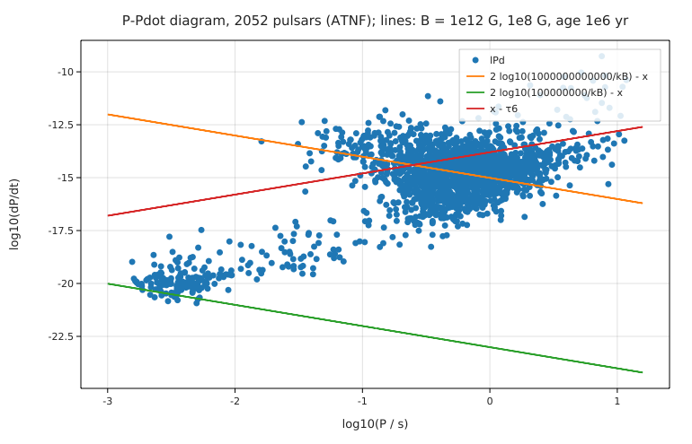

# Pulsar spin-down: fields, ages and the Crab's braking index (ATNF catalogue)

**Physics.** A pulsar is a rotating magnetised neutron star (moment of inertia I ≈ 10⁴⁵ g cm², radius R ≈ 10 km). Its
rotational energy falls at Ė = IΩ|Ω̇| = 4π²IṖ/P³. If the loss is magnetic-dipole radiation, Ė = 8πR⁶B²Ω⁴/(3μ₀c³) for an
equatorial surface field B, so

B = √(3μ₀c³ I P Ṗ/(32π³R⁶)) = 3.2 × 10¹⁹ G √(PṖ/1 s),   τ_c = P/(2Ṗ) (the characteristic age).

In general Ω̇ ∝ −Ωⁿ with braking index n = νν̈/ν̇² (n = 3 for a dipole). With n and the true age t, the birth period is
P₀ = P[1 − (n − 1)Ṗt/P]^(1/(n−1)).

**Data.** The ATNF Pulsar Catalogue (Manchester et al. 2005) from VizieR (B/psr): 2052 pulsars with measured P and Ṗ > 0
(see [SOURCE.md](SOURCE.md); the ATNF web site refused the connection, and the VizieR copy is an older catalogue version).

**Code.** [`pulsars.fm`](pulsars.fm) derives the field formula from the dipole luminosity with units (`B_dip(P, Pd)` in SI; the
program prints the constant in gauss), checks it and τ_c and Ė against the catalogue's own derived columns for all 2052 pulsars,
compares ordinary and millisecond pulsars, and works out the Crab pulsar's ages, braking index and birth period. Run it
from this folder with `fermium run pulsars.fm` (0.35 s).

## Results

| quantity | Fermium | published | source |
|---|---|---|---|
| dipole-field constant | **3.200 × 10¹⁹ G** (from μ₀, c, I = 10⁴⁵ g cm², R = 10 km) | 3.2 × 10¹⁹ G | ATNF convention (column Bsurf) |
| B, τ_c, Ė vs the catalogue's columns, 2052 pulsars | largest differences 1.5 %, 3.3 %, 4.9 % | | the catalogue rounds to 2–3 digits |
| ordinary pulsars (1870) | median B = 1.2 × 10¹² G, median τ_c = 4.8 Myr | B ~ 10¹² G | textbook |
| millisecond pulsars (P < 30 ms, 182) | median B = 2.6 × 10⁸ G, median τ_c = 4.8 Gyr; 136 in binaries | B ~ 10⁸–10⁹ G, recycled in binaries | textbook |
| Crab Ė | **4.46 × 10³⁸ erg/s** | 4.5 × 10³⁸ erg/s | catalogue |
| Crab B | 3.79 × 10¹² G | 3.79 × 10¹² G | catalogue |
| Crab τ_c vs true age | 1257 yr vs **937.5 yr** (SN 1054, at epoch 1991.5) | τ_c overestimates the age | |
| Crab braking index νν̈/ν̇² | **2.342** from the catalogue's ν̈ | **2.509 ± 0.001** | Lyne, Pritchard & Graham Smith 1993 |
| Crab birth period | 19.9 ms (n = 2.34), **19.3 ms (n = 2.51)**, 16.8 ms (n = 3) | ≈ 19 ms | Lyne et al. 1993 |
| Crab period doubles in | 3080 yr (n = 2.51) | | |

**Honest reading.** The formulas reproduce the catalogue's derived columns to their rounding. The braking index from the
catalogue's single ν̈ (2.342) is 7 % below Lyne et al.'s value from long-term timing: one ephemeris' ν̈ is sensitive to glitch
recovery and timing noise, which the long-baseline analysis averages out. With the published n = 2.51, the birth period
comes out at 19.3 ms, as Lyne et al. found.

## Friction
- Names with a combining dot (`ν̇`, `ν̈`, the physicist's notation for time derivatives) are rejected ("unexpected
  character '̇'"); written `ν_dot`, `ν_ddot`. Logged in BACKLOG.md.
- A function whose last line is `if … then a else b` "never returns a value" (the line is taken as a statement);
  `mid = if … then … else …` and then `mid` works.
- A plot axis range can't be negative: `y from -22 to -9` is refused ("the y range must be constants").
- Variables set only inside an `if` in a loop need a value before the loop (`P = 0 s`): a clear, correct error.
