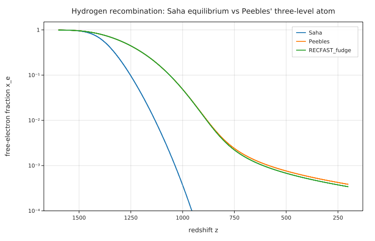
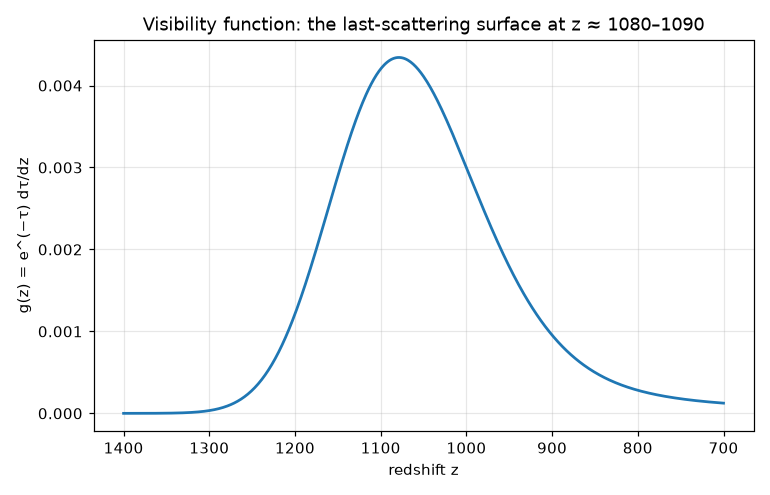

# Hydrogen recombination and the CMB last-scattering surface

**Physics.** The early universe was a hot plasma. Free electrons scatter photons (Thomson scattering), so the
universe was opaque. As it expands and cools, protons and electrons combine into hydrogen. Once the free
electrons are gone, the photons stream freely, and we see them today as the cosmic microwave background.
The free-electron fraction x_e = n_e/n_H follows from:

- **Saha equilibrium:** x_e²/(1 − x_e) = (m_e k_B T/2πħ²)^{3/2} e^{−13.6 eV/k_B T} / n_H. Recombination and
  ionisation balance exactly.
- **Peebles' three-level atom** (P. J. E. Peebles, ApJ **153**, 1 (1968); the form used here is that of
  Seager, Sasselov & Scott, ApJS **128**, 407 (2000), eq. 1 with the RECFAST fudge factor F set to 1):

  dx_e/dt = −C [n_H α_B x_e² − β_B (1 − x_e) e^{−E_α/k_B T}],   C = (Λ_2s + Λ_α)/(Λ_2s + Λ_α + β_B).

  A recombination straight to the ground state emits a photon that ionises the next atom, so only captures to
  n ≥ 2 count (case B, α_B). An electron in n = 2 then reaches the ground state only if the atom decays by two
  photons (Λ_2s = 8.2246 s⁻¹), or if its Lyman-α photon redshifts out of the line
  (Λ_α = 8πH/(λ_α³ n_1s)). Otherwise it is photo-ionised again first (β_B, from α_B by detailed balance).
  C is the probability that an atom in n = 2 reaches the ground state. This bottleneck makes recombination
  lag far behind Saha.
- **Visibility function:** g(z) = e^{−τ} dτ/dz with dτ/dz = n_e σ_T c/(H(1 + z)). This is the probability that
  a CMB photon last scattered at redshift z. (Per unit time, g = −dτ/dt e^{−τ}, because τ falls as t grows.)
  Planck defines the last-scattering redshift z_* by τ(z_*) = 1.

**Inputs.** Planck 2018 (Planck Collaboration VI, A&A **641**, A6 (2020), Table 2, TT,TE,EE+lowE+lensing):
H₀ = 67.36 km/s/Mpc, Ω_b h² = 0.02237, Ω_c h² = 0.1200, Y_P = 0.2454, T_CMB = 2.7255 K, N_eff = 3.046.
Case-B recombination coefficient: the fit of Péquignot, Petitjean & Boisson, A&A **251**, 680 (1991), as used
in RECFAST. E_ion = 13.598434 eV and λ_α = 121.567 nm (NIST). The companion reproduction
[hydrogen_levels](../hydrogen_levels/) gets 121.5684 nm from the Schrödinger equation.

**Code.** [`recombination.fm`](recombination.fm) writes each rate as a one-line function with units:
`α_B(T, F)`, `β_B(T, F)`, `Λ_α(z, x)`, `C(z, x, F)`, and the right-hand side `peebles(z, x, F)`. It then solves

```
solve
    xe' = peebles(z, xe, 1)
    τ' = xe s(z)
    with xe(1600) = x_saha(1600), τ(1600) = 0
    for z from 1600 to 200 using radau tolerance 1e-10 absolute 1e-14
```

with z as the independent variable, running backwards from 1600 to 200. The optical depth is counted from
z = 200: τ₂₀₀(z) = τ(z) − τ[end]. The last-scattering redshift is `solve τ(z_star) − τ[end] = 1 for z_star …`.
The peak of g is where dg/dz = e^{−τ}(κ' − κ²) = 0 with κ = dτ/dz, written as
`solve xe'(zg) s(zg) + xe(zg) s'(zg) = κ(zg)² for zg …`. The same equations are solved again with RECFAST's
F = 1.14, and once more from z = 2500. The program runs in 2.5 s. Run it from this folder with
`fermium run recombination.fm`.

## Results

| quantity | Fermium (Peebles, F = 1) | published | source |
|---|---|---|---|
| last scattering, τ(z_*) = 1 | **z_* = 1089.61** | **1089.92 ± 0.25** | Planck 2018 VI, Table 2 |
| same, with F = 1.14 | 1090.43 | 1089.92 ± 0.25 | |
| peak of g in conformal time | z = 1089.12 | ≈ 1090 | |
| peak of g(z) in redshift | z = 1078.80 | | |
| FWHM of g(z) | Δz = 203 (967 to 1170) | Δz ≈ 80 is often quoted as the width; that is a Gaussian σ, and FWHM ≈ 190 | from memory |
| x_e at z_* | 0.1318 | | |
| x_e = 0.5, Saha | z = 1368.97 | z ≈ 1380 (Saha, textbook value; Ryden, *Introduction to Cosmology*) | from memory |
| x_e = 0.5, Peebles | z = 1272.65 | | |
| x_e(200) (freeze-out) | **3.85×10⁻⁴** (F = 1.14: 3.40×10⁻⁴) | **≈ 2×10⁻⁴** residual ionisation | RECFAST (Seager et al. 2000); HyRec (Ali-Haïmoud & Hirata, PRD **83**, 043513 (2011)) |

| z | 1500 | 1400 | 1300 | 1200 | 1100 | 1000 | 800 | 600 | 400 | 200 |
|---|---|---|---|---|---|---|---|---|---|---|
| x_e Peebles | 0.955 | 0.808 | 0.569 | 0.327 | 0.146 | 0.0487 | 3.74×10⁻³ | 1.06×10⁻³ | 5.84×10⁻⁴ | 3.85×10⁻⁴ |
| x_e Saha | 0.948 | 0.654 | 0.213 | 0.0391 | 4.8×10⁻³ | 3.7×10⁻⁴ | 3.2×10⁻⁷ | 2.4×10⁻¹² | 1.2×10⁻²² | – |

- **z_* agrees with Planck to 0.3 (0.03 %, 1.2σ of Planck's error).** This is partly luck. Peebles' atom
  leaves out the multi-level cascade (RECFAST mimics it with F = 1.14, which moves z_* to 1090.43), helium, and
  the corrections of modern codes (HyRec, CosmoRec: Lyman-series radiative transfer, two-photon transitions from
  higher levels). Their effects on z_* are a few tenths each, with both signs. τ below z = 200 is also left
  out. It is at most 2×10⁻³ (x_e ≤ 3.85×10⁻⁴ down to z = 0, no reionisation), and it would lower z_* by at
  most 0.2.
- **The visibility function peaks at z = 1078.8 in redshift, and at z = 1089.1 in conformal time.** The
  "last-scattering surface at z ≈ 1090" is the conformal-time peak, or τ = 1; per unit redshift the peak sits
  11 lower. The width is about 200 in z (FWHM): last scattering took about 100 000 years.
- **Saha fails badly.** It predicts recombination (x_e = 0.5) at z = 1369, and x_e(1000) = 3.7×10⁻⁴. Peebles
  gives z = 1273 and x_e(1000) = 0.049, 130 times more. The n = 2 bottleneck (C ≈ 0.02 near z = 1100: an atom in n = 2 is ionised
  again 50 times more often than it reaches the ground state) holds
  recombination back, and the falling density then freezes it out: at z = 200 the recombination rate is below
  the expansion rate, and x_e is still falling only slowly (d ln x_e/d ln(1 + z) = 0.37).
- **The freeze-out value is about twice the published ≈ 2×10⁻⁴.** Three reasons, all known limits of this
  model. (1) The integration stops at z = 200, and x_e keeps falling slowly after that. (2) T_gas = T_CMB is
  assumed: in reality the gas decouples from the photons at z of a few hundred and cools faster, which speeds up
  recombination. (3) Peebles' atom recombines more slowly than a multi-level atom; F = 1.14 alone brings x_e(200)
  from 3.85 to 3.40×10⁻⁴. The "≈ 2×10⁻⁴" is the commonly quoted RECFAST/HyRec residual at low z. It is typed
  from memory, not read off a table.
- **Stiffness.** From z = 1600 (x_e = 0.994) the problem is only mildly stiff: RK45 (no `using`) takes 343
  steps and gives the same numbers. From z = 2500, where x_e sits on its Saha value and the two rates cancel
  almost exactly, RK45 stops with "the ODE solver needed too many steps … add using radau". Radau takes
  1184 steps, and x_e(200) and x_e(1100) agree with the z = 1600 start to all 8 printed digits.
- Test: `legacy/tests/test_research.py` solves the same equations with SciPy's `solve_ivp(method="Radau")`
  (rtol 10⁻¹¹). x_e(z) at every printed z, x_e(200), z(τ = 1), both visibility peaks, the half-maximum points,
  the F = 1.14 run and the z = 2500 start agree to 10⁻⁵ or better (z_* to 10⁻⁶).





## What writing it in Fermium showed
- **The physics reads like the paper.** Each rate is one line with its units, and the unit checker settles the
  (m_e k_B T/2πħ²)^{3/2} factors and the λ_α³ in Λ_α. z as the independent variable, a backwards range, and
  `using radau` with `absolute` needed no special handling. Conditions on the solution are one line each:
  `solve τ(z_star) − τ[end] = 1 …`, and the peak of g as dκ/dz = κ², with `xe'(z)` from the solution and `s'(z)`
  differentiated symbolically. The solution, and functions of it, take lists: `xe(redshift)`, `g(z_g)`.
- **The Hubble h and Planck's h share a name.** `h = 0.6736` silently replaces Planck's constant for the rest
  of the program (overriding a constant is allowed and gives no warning), so E_α is written `2π ħ c / λ_α`.
  Using `h c / λ` afterwards would at least be a unit error, not a wrong number.
- **Juxtaposition binds tighter than `/`.** `(1 - Y_p) Ωbh2 / h² ρ_crit / m_H` means Ωbh2/(h² ρ_crit). It was
  caught only because the print converted to `1/m³` ("can't show a quantity with units [m³/kg²] in 1/m³"). The
  program writes `(Ωbh2 / h²) ρ_crit`.
- **`100 h km/s/Mpc` is an error** (a unit only goes right after a number), so H₀ is written 67.36 km/s/Mpc.
- **RK45's "too many steps" error** from z = 2500 said "reached z = 2500", the starting point, although the
  solver had been running for 9 s. It does suggest `using radau`, which is the right fix.
- **Plots:** the Saha curve is floored with `max(x_saha(redshift), 1e-6)`, because its values reach 10⁻²² at
  low z. Axis labels need `xlabel`/`ylabel`, and the legend shows the list names (`Saha`, `Peebles`,
  `RECFAST_fudge`).
