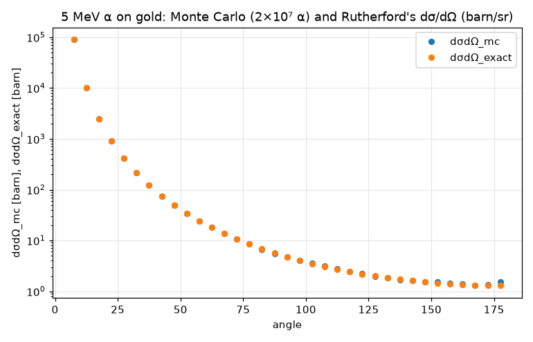

# Rutherford scattering by Monte Carlo, against dσ/dΩ ∝ 1/sin⁴(θ/2) and Geiger–Marsden (1913)

**Physics.** An α particle (charge ze) passing a gold nucleus (Ze) at impact parameter b is deflected by θ with

b = (d/2) cot(θ/2),   d = zZe²/(4πε₀T)  (the distance of closest approach in a head-on collision),

and since the beam is spread uniformly over the target, the cross-section is dσ/dΩ = (d/4)²/sin⁴(θ/2)
(E. Rutherford, *Phil. Mag.* **21**, 669 (1911)). H. Geiger and E. Marsden, *Phil. Mag.* **25**, 604 (1913), counted
scintillations at angles from 15° to 150° and found N sin⁴(θ/2) roughly constant, over a range where N changes by
a factor of 4 000. Their gold counts (Table II, as widely reproduced): 150°: 33.1, 135°: 43.0, 120°: 51.9,
105°: 69.5, 75°: 211, 60°: 477, 45°: 1435, 37.5°: 3300, 30°: 7800, 22.5°: 27300, 15°: 132000.

**Code.** [`rutherford.fm`](rutherford.fm) fires 2×10⁷ α particles of 5 MeV at a gold nucleus: b = b_max √(rand()) is
uniform over a disk whose edge scatters by 5°, θ = 2 atan(d/(2b)), and the angles go into 5° bins (35 bins from 5°
to 180°) and into 5° windows around each Geiger–Marsden angle. Each α stands for π b_max²/N of cross-section, so
counts/N · π b_max²/ΔΩ is dσ/dΩ in barn/sr. The expected content of every bin is exact:
N (b(θ₁)² − b(θ₂)²)/b_max². The 2×10⁷-iteration loop takes about 2 s. Run it from this folder with
`fermium run rutherford.fm`.

**Random numbers.** `rand()` has no seed function. The compiled program calls the C library's `drand48` without
seeding it, so every `fermium run` happens to give the same numbers (the ones below); inside the test process the
sequence continues from earlier programs, so `tests/test_research.py` uses statistical bounds (5σ Poisson, a χ²
with a 10⁻⁶ false-alarm rate), not exact values.

## Results

- d = **45.50 fm** (closed form: 2·79·1.44 MeV fm / 5 MeV), b_max = 521.1 fm, σ(θ > 5°) = 8531 barn.
- **χ² of the 35 bins against the exact Rutherford contents: 35.6 for 35 degrees of freedom**: the Monte Carlo
  histogram is Rutherford's distribution, from 5° (≈10⁷ α per bin) to 180° (≈200 α per bin).
- Fraction scattered backwards (θ > 90°): 0.001920 (MC) vs 0.001906 exact (1.4σ); of the α's deflected by more than 5°, about 1 in 500 come back (the "15-inch shell
  bouncing off tissue paper" of Rutherford's remark).
- dσ/dΩ(90°) = 5.176 barn/sr.

| θ | MC dσ/dΩ sin⁴(θ/2)/(d/4)² | α in 5° window | exact (5° window average) | Geiger–Marsden N sin⁴(θ/2), normalised to mean 1 |
|---|---|---|---|---|
| 150° | 1.04 | 997 | 1.00 | 0.894 |
| 135° | 0.973 | 1570 | 1.00 | 0.972 |
| 120° | 1.00 | 2569 | 1.00 | 0.906 |
| 105° | 1.02 | 4143 | 1.00 | 0.854 |
| 75° | 1.02 | 11966 | 1.00 | 0.899 |
| 60° | 0.991 | 22837 | 1.00 | 0.925 |
| 45° | 1.00 | 55047 | 1.01 | 0.955 |
| 37.5° | 1.01 | 95545 | 1.01 | 1.09 |
| 30° | 1.01 | 187274 | 1.01 | 1.09 |
| 22.5° | 1.02 | 450047 | 1.03 | 1.23 |
| 15° | 1.06 | 1571295 | 1.06 | 1.19 |

- The Monte Carlo reproduces 1/sin⁴(θ/2) within its Poisson errors (1/√counts: 3 % at 150°). The window averages above
  1 at small angles are real: over a 5° window at 15° the 1/sin⁴ factor changes by a factor of 2.6, and the average
  of a convex function exceeds its central value.
- Geiger and Marsden's N sin⁴(θ/2) is constant to within −15 %/+23 % over the whole range, while N itself varies by
  a factor of 4 000: the same trend as the Monte Carlo. Their small-angle excess is in the same direction as the
  finite-window effect above (their detector subtended a few degrees), plus the multiple small-angle scattering in
  the foil that a single-scattering model leaves out. Their α's were 7.7 MeV (RaC′), not 5 MeV; the *shape* of the
  distribution does not depend on the energy, so only shapes are compared.

## What writing it in Fermium showed
- The sampling loop is four lines, with units: b in fm, θ an angle, the cross-section in barn/sr.
- **`2 b` is 2 barn.** The physicist's name for the impact parameter is `b`, and `2 b` right after a number is the
  barn (with a warning), so `atan(d / (2 b))` would have been a unit error. `2*b` works; the warning pointed at it.
- **No seed for `rand()`**, and the compiled `drand48` is never seeded: runs are reproducible by accident, a program
  can't choose its seed, and two Monte Carlo runs with different seeds can't be compared without restarting.
- **No `cot`**, and no list slices (`sum(counts[18:35])` is a parse error "expected ']'"); written as `1/tan` and a loop.
- `plot … in barn` labels the axis `[barn]` for a quantity in barn/sr (steradians are dimensionless, so the unit
  vanishes); the title has to say "barn/sr".
- `counts[k] += 1` on a list made by `zeros(n)` works, which made the histogram easy.
