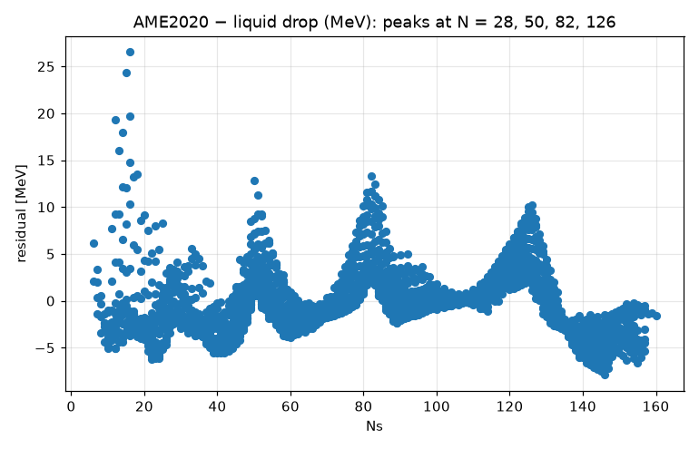
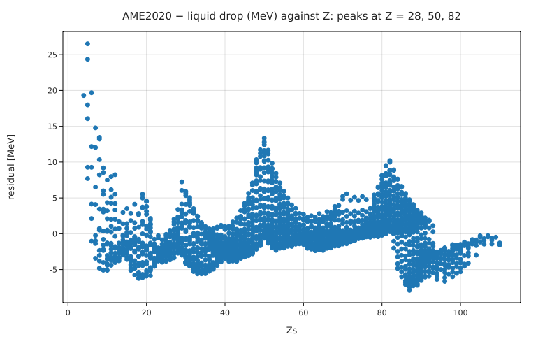

# The semi-empirical mass formula, fitted to AME2020

**Physics.** The liquid-drop model writes the binding energy of a nucleus with Z protons and A nucleons as

B(Z, A) = a_V A − a_S A^(2/3) − a_C Z(Z−1)/A^(1/3) − a_A (A−2Z)²/A + P a_P/√A

(volume, surface, Coulomb, asymmetry and pairing terms; P = +1 for even–even, −1 for odd–odd, 0 for odd A).
It has no shell structure, so the residuals *measured − formula* show the magic numbers: nuclei with
N or Z = 28, 50, 82, 126 are bound more strongly than a smooth drop.

**Data.** The AME2020 atomic mass evaluation (W.J. Huang, M. Wang et al., *Chinese Physics C* **45**, 030002 (2021)),
file `mass_1.mas20.txt` from https://www-nds.iaea.org/amdc/ame2020/. `prepare.py` downloads it and writes
`ame2020_binding.csv`: the 2484 nuclei with A ≥ 16 whose masses are measured (extrapolated `#` values dropped),
with columns `Z, N, A, P, B [MeV]`.

**Code.** [`semf.fm`](semf.fm) loads the table, fits the five coefficients with `fit` (units checked: every term is
in MeV), computes the residual for every nucleus, and plots them against N and Z. Run it from this folder with
`fermium run semf.fm`.

## Results

| coefficient | Fermium fit (this data) | Rohlf (1994), as quoted widely | Krane, *Introductory Nuclear Physics* |
|---|---|---|---|
| a_V | 15.414 ± 0.023 MeV | 15.75 MeV | 15.5 MeV |
| a_S | 16.86 ± 0.07 MeV | 17.8 MeV | 16.8 MeV |
| a_C | 0.6952 ± 0.0016 MeV | 0.711 MeV | 0.72 MeV |
| a_A | 22.50 ± 0.06 MeV | 23.7 MeV | 23 MeV |
| a_P | 12.0 ± 0.9 MeV (with 1/√A) | 11.18 MeV (1/√A) | 34 MeV (with A^(−3/4)) |

- rms residual: **3.31 MeV** over 2484 nuclei (binding energies range up to ~1800 MeV). Published fits of this
  five-term form quote a few MeV; the exact numbers depend on which nuclei are included and on Z² vs Z(Z−1).
- The coefficients agree with an independent NumPy least-squares solution on the same file to 2×10⁻⁴
  (`legacy/tests/test_research.py`), and are in the range of the textbook values (which were fitted to older, smaller data sets).
- **Magic numbers:** the largest extra binding for A ≥ 40 is **13.3 MeV at Z = 50, N = 82 (¹³²Sn, doubly magic)**.
  Mean residual of the isotones: N = 50: +3.5 MeV (N ± 8: −3.5, −0.6); N = 82: +5.6 MeV (+0.3, −0.1);
  N = 126: +5.4 MeV (+2.8, −2.3); N = 28: +0.3 MeV (−1.7, −2.5).

The big scatter at small N is the light nuclei, where a liquid drop is a poor description.

## What writing it in Fermium showed
- `fit` handled a 5-parameter model over 2484 rows with a unit check on every term.
- Two rough edges found and fixed on the way: the fit's rms residual and a list filled by `push` were shown in J
  instead of MeV (now the data's unit), and a scatter plot of two lists drew lines (new `with points` option).
