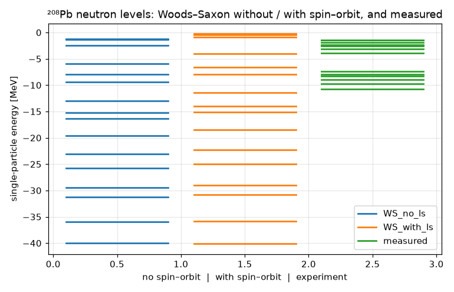
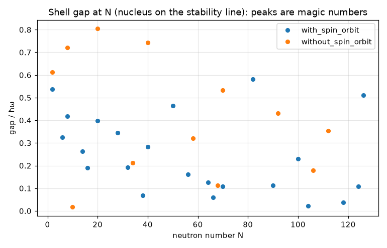

# The nuclear shell model: Woods–Saxon levels, spin–orbit splitting and the magic numbers

**Physics.** Nuclei with 2, 8, 20, 28, 50, 82 or 126 protons or neutrons are unusually tightly bound. Mayer
(Phys. Rev. **75**, 1969 (1949)) and Haxel, Jensen & Suess (Phys. Rev. **75**, 1766 (1949)) explained these
*magic numbers*: each nucleon moves in the average potential of all the others, and a strong spin–orbit term
lowers j = l + ½ below j = l − ½. A central well alone gives the oscillator-like closures 2, 8, 20, 40, 70, 112.
With the spin–orbit term, the high-j member of each major shell (1f7/2, 1g9/2, 1h11/2, 1i13/2) drops into the
shell below, and the closures move to 28, 50, 82 and 126.

The mean field used here is the Woods–Saxon potential with a spin–orbit term, in the parametrisation of
**Bohr & Mottelson, *Nuclear Structure* Vol. I (Benjamin 1969), §2-4, eqs. (2-181)–(2-182)**:

V(r) = −V₀ f(r) + V_ls r₀² (l·s) (1/r) df/dr,   f(r) = 1/(1 + e^((r − R)/a)),   R = r₀ A^(1/3),

with V₀ = (51 − 33 (N − Z)/A) MeV for neutrons, V_ls = 0.44 V₀, r₀ = 1.27 fm, a = 0.67 fm, and
l·s = [j(j + 1) − l(l + 1) − ¾]/2. The parameters are typed from memory of that section; the equation numbers
may be off by one. The shell spacing ħω ≈ 41 A^(−1/3) MeV is also from B&M. With ψ = (u(r)/r) Y, each (l, j)
gives a radial eigenvalue problem,

−ħ²/(2m_n) u'' + [V(r) + ħ² l(l + 1)/(2 m_n r²)] u = E u,   u(0) = 0,  u(40 fm) = 0.

Only neutrons are computed. Protons would also need the Coulomb potential of the other protons.

**Code.** [`shell.fm`](shell.fm) writes the radial equation as it is written above and hands it to Fermium's
eigenvalue solver: `solve … ψ = E ψ with ψ(0 fm) = 0, ψ(r_box) = 0 for r from 0 fm to r_box lowest 5`
(finite differences with Richardson extrapolation, reference §20). It solves l = 0 … 7, j = l ± ½, and keeps
the negative (bound) energies. It then sorts the levels, fills them with 2j + 1 neutrons each, and prints each
gap. The program does three things:
1. It computes the ²⁰⁸Pb neutron spectrum without and with the spin–orbit term.
2. It compares the levels near the Fermi surface with experiment.
3. It scans the magic numbers. For each neutron number N, it takes the nucleus on the valley of stability
   (Green's formula, Z = A/(1.98 + 0.0155 A^(2/3))). If N exactly fills a level there, it measures the gap to
   the next level, in units of ħω. The next N tried is the next level-filling number of that nucleus.

The box (40 fm) is wide enough: moving the wall to 60 or 80 fm changes the least-bound level (3d3/2, −0.65 MeV)
by 3×10⁻⁶ MeV. The program runs in ~25 s (about 450 eigenvalue problems). Run it from this folder with
`fermium run shell.fm`.

## Results

**Magic numbers.** Gap at the Fermi surface divided by ħω = 41 A^(−1/3) MeV, for the nucleus (N, Z) on the
stability line:

| N | Z | gap (MeV) | gap/ħω |   | N (no l·s) | gap/ħω (no l·s) |
|---|---|---|---|---|---|---|
| **2** | 2 | 13.87 | **0.537** | | **2** | **0.612** |
| 6 | 6 | 5.84 | 0.326 | | **8** | **0.721** |
| **8** | 7 | 6.94 | **0.417** | | 10 | 0.017 |
| 14 | 13 | 3.59 | 0.262 | | **20** | **0.804** |
| 16 | 14 | 2.52 | 0.191 | | 34 | 0.213 |
| **20** | 17 | 4.89 | **0.397** | | **40** | **0.742** |
| **28** | 23 | 3.80 | **0.344** | | 58 | 0.321 |
| 32 | 26 | 2.03 | 0.191 | | 68 | 0.113 |
| 38 | 31 | 0.68 | 0.068 | | **70** | **0.532** |
| 40 | 32 | 2.78 | 0.282 | | 92 | 0.431 |
| **50** | 39 | 4.27 | **0.465** | | 106 | 0.180 |
| 56, 64, 66, 70 | | ≤ 1.4 | ≤ 0.16 | | 112 | 0.353 |
| **82** | 59 | 4.58 | **0.581** | | | |
| 90, 100, 104, 118, 124 | | ≤ 1.7 | ≤ 0.23 | | | |
| **126** | 83 | 3.53 | **0.511** | | | |

- **With spin–orbit, the seven largest gaps are at N = 2, 8, 20, 28, 50, 82, 126**, the observed magic numbers.
  **Without it, the five largest are at 2, 8, 20, 40, 70**, the harmonic-oscillator closures. Both lists are
  printed by the program and checked in the test.
- The margin at 28 is small: its gap (0.344 ħω) only just beats N = 6 (0.326 ħω, the 1p3/2 closure in ¹²C,
  a known sub-shell), and N = 40 (0.282 ħω, ⁹⁰Zr's 2p1/2 closure, another known sub-shell) comes next. Gaps
  of 0.34–0.58 ħω separate the magic numbers from everything else, which is ≤ 0.26 ħω.
- The scan only tries the level-filling numbers of the nucleus it has just computed, so a closure that exists
  only in a neighbouring nucleus can be skipped. Scanning every N from 2 to 130 (done in Python while writing
  this) finds two more small gaps: N = 114 (0.012 ħω) with spin–orbit, and N = 18 (0.112 ħω) without. They
  change nothing above.

**²⁰⁸Pb neutrons near the Fermi surface (N = 126).** Measured single-particle energies are
E = −S_n(²⁰⁸Pb) − E_x(²⁰⁷Pb) for holes and E = −S_n(²⁰⁹Pb) + E_x(²⁰⁹Pb) for particles, with
S_n(²⁰⁸Pb) = 7.368 MeV and S_n(²⁰⁹Pb) = 3.937 MeV (AME), and the excitation energies of the single-particle
states in ²⁰⁷Pb and ²⁰⁹Pb (ENSDF). These are the values usually tabulated for ²⁰⁸Pb, e.g. in Ring & Schuck,
*The Nuclear Many-Body Problem*, and in Vautherin & Brink, Phys. Rev. C **5**, 626 (1972). **They are typed
from memory**, rounded to 10 keV; check them against ENSDF before quoting them.

| level | Woods–Saxon (Fermium) | measured | difference |
|---|---|---|---|
| 1h9/2 | −10.86 MeV | −10.78 MeV | −0.08 |
| 2f7/2 | −10.34 | −9.71 | −0.63 |
| 1i13/2 | −8.51 | −9.00 | +0.49 |
| 3p3/2 | −8.19 | −8.27 | +0.08 |
| 2f5/2 | −8.04 | −7.94 | −0.10 |
| 3p1/2 (last filled) | −7.289 | −7.37 | +0.08 |
| 2g9/2 (first empty) | −3.753 | −3.94 | +0.19 |
| 1i11/2 | −3.02 | −3.16 | +0.14 |
| 1j15/2 | −1.81 | −2.51 | +0.70 |
| 3d5/2 | −1.87 | −2.37 | +0.50 |
| 4s1/2 | −1.26 | −1.90 | +0.64 |
| 2g7/2 | −0.72 | −1.44 | +0.72 |
| 3d3/2 | −0.65 | −1.40 | +0.75 |

- **The N = 126 gap:** 3.536 MeV (3p1/2 → 2g9/2), against 3.431 MeV measured (S_n(²⁰⁸Pb) − S_n(²⁰⁹Pb)).
- **rms difference: 0.48 MeV** over the 13 levels. The hole states are within 0.1 MeV, except 2f7/2 and 1i13/2
  (±0.5–0.6 MeV). The level order is right, except that 3d5/2 and 1j15/2 (0.06 MeV apart in the calculation)
  are swapped. The particle states above 2g9/2 are 0.5–0.75 MeV too weakly bound. This is the known limit of a
  static potential with the bare nucleon mass: coupling to surface vibrations pulls the levels near the Fermi
  surface closer together (B&M Vol. II). No parameter was tuned here.
- Test: all 29 bound ²⁰⁸Pb levels (and the 16 without spin–orbit) agree with an independent SciPy `solve_ivp`
  (DOP853) shooting computation to 10⁻⁶ relative, and with a separate NumPy finite-difference solve. The whole
  gap scan (22 + 12 nuclei) agrees to 10⁻⁵.

## What writing it in Fermium showed
- **The eigenvalue solver makes this short.** One `solve … lowest 5` per (l, j), written exactly as the radial
  Schrödinger equation with its units, and about 450 of them run in 25 s. The magic-number scan (a function
  with a `solve` for Z inside, then a spectrum per nucleus) needed no numerical code at all.
- **`f'(r)` of a known function is refused inside an eigenvalue equation.** Writing the spin–orbit term as
  `Vls r0² ls f'(r) / r` gives "an eigenvalue problem needs one unknown function with a second derivative,
  like ψ''": the checker counts `f'` as a second unknown, although f is a defined function. `df = d/dr f(r)`
  outside the equation works. The program writes df/dr = −f(1 − f)/a by hand, because of the next point.
- **`d/dr f(r, R)` gives a one-argument function.** The other arguments must be globals ("df takes 1 argument
  but was given 2", and then "R isn't defined").
- **Physics names that are units.** `l` (litre: `2 l` warns), `N` (newton: `3 N`), `A` (ampere:
  `solve A - A/(…) = N for A …` fails with a unit error), `m` and `mN` (metre, millinewton: `2 m_n r²` had to
  be `m_n`), and `u` (atomic mass unit). The worst was `u`: the radial function `u'' … = E u` gave "an
  eigenvalue problem needs one unknown function with a second derivative, like ψ''", with no mention that `u`
  was read as a unit. The program uses ℓ, ψ and x instead.
- **`(51 - 33 (N - Z) / A) MeV` is an error:** a unit only goes right after a number, so it is `* 1 MeV`.
- **Text:** there is no string concatenation, so level names print as `3 p1/2` (with a space), from a list of
  names indexed by (l, j). There is no `argsort`: the program sorts the energies, then finds each one's
  level with a loop.
- **Lists can't be cleared from inside a function.** `xs = []` there makes a local list, so the eight lists are
  reset at the top level before each nucleus.
- **An if-expression can't hold `in MeV to 3 digits`**, so a print with an optional gap became an `if`/`else`
  with two prints. A `plot` can't be continued on an indented line.
- **Plots:** a level scheme needs text labels on the levels, and Fermium's plots have none. The bars are drawn
  as line segments separated by NaN (`nan = 0 * ∞`), with an x axis that has no meaning. The legend shows the
  list names (`WS_no_ls`, `with_spin_orbit`).
