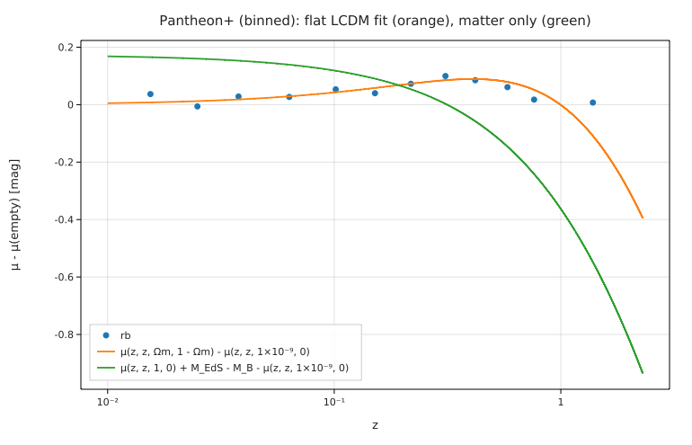

# The accelerating universe from the Pantheon+ supernovae

**Physics.** Type Ia supernovae are standardisable candles: after light-curve corrections their peak magnitude is
m = μ(z) + M_B, with the distance modulus μ = 5 log₁₀(d_L/10 pc) and, for a Friedmann universe with matter Ωm, a cosmological
constant ΩΛ and curvature Ω_k = 1 − Ωm − ΩΛ,

d_L = (1 + z) D_M,   D_M = D_H sinh(√Ω_k χ)/√Ω_k (or sin, or χ), χ = ∫₀^z dz′/E(z′), E = √(Ωm(1+z)³ + Ω_k(1+z)² + ΩΛ), D_H = c/H₀.

Distant supernovae are fainter than a matter-only universe allows: the expansion accelerates (Riess et al. 1998;
Perlmutter et al. 1999). H₀ is degenerate with M_B, so it is fixed (70 km/s/Mpc) and M_B is fitted.

**Data.** The Pantheon+ compilation (Scolnic et al. 2022; Brout et al. 2022): 1701 light curves of 1550 type Ia supernovae,
downloaded from the Pantheon+ data release on GitHub (see [SOURCE.md](SOURCE.md)). `prepare.py` keeps the 1590 with
z > 0.01, as the cosmology analysis does.

**Code.** [`hubble.fm`](hubble.fm) writes D_C as an `∫` inside a function and the curvature cases with `if`, then fits
`mb / dmb = (μ(z, zhel, Ωm, 1 - Ωm) + M_B) / dmb` (a χ² fit with the diagonal errors) for flat ΛCDM, for a matter-only and an
empty universe, and with curvature free. Every fit evaluation integrates the Friedmann equation for all 1590 supernovae; the
program runs in 10.5 s. Run it from this folder with `fermium run hubble.fm`.

## Results

| quantity | Fermium (diagonal errors) | published | source |
|---|---|---|---|
| flat ΛCDM Ωm | **0.350 ± 0.012** | **0.334 ± 0.018** | Brout et al. 2022 (SN only, full stat+sys covariance) |
| χ² (flat) | 697 for 1588 degrees of freedom | | the diagonal errors include systematics that the full covariance treats as correlated, hence χ²/dof = 0.44 |
| q₀ = Ωm/2 − ΩΛ | −0.474 | | accelerating today |
| onset of acceleration z_t = (2ΩΛ/Ωm)^(1/3) − 1 | 0.548 | | |
| Einstein–de Sitter (Ωm = 1, ΩΛ = 0) | Δχ² = **+661** | ruled out | |
| empty universe (Milne) | Δχ² = +35.8 | | |
| ΛCDM with curvature | Ωm = 0.299 ± 0.046, ΩΛ = 0.579 ± 0.063 (Ω_k = 0.12) | | |
| ΩΛ > 0 | **9.2 σ** (diagonal errors) | | the 1998 discovery (Riess et al.; Perlmutter et al.), here with 1590 light curves |

The binned Hubble residuals (relative to an empty universe) rise to +0.10 mag at z ≈ 0.3 and fall back, the shape of flat
ΛCDM; a matter-only universe predicts −0.15 mag at z ≈ 0.6 where the data show +0.06 mag.

**Honest reading.** With only the diagonal errors, Ωm lands 0.9σ above the published value (0.350 vs 0.334), and its error
is too small (0.012 vs 0.018) because the correlated systematics are not propagated; the full 1701 × 1701 covariance matrix
(`Pantheon+SH0ES_STAT+SYS.cov` in the release) is not used. The highest-redshift bin (z ≈ 1.4, 0.007 ± 0.062 mag) sits
above flat ΛCDM (−0.109) by 1.9σ.

## Friction
- Fermium warned that `χ` and `x` look alike (both were used: `x` as the integration variable, `χ` as the comoving distance).
- A χ² fit with errors needs dividing both sides of `fit` by the error; the fit report then calls its rms residual a
  plain number (0.662), which is √(χ²/N), not a magnitude.
- Four fits each print their own report; see [mass_luminosity](../mass_luminosity/) for the same friction.
