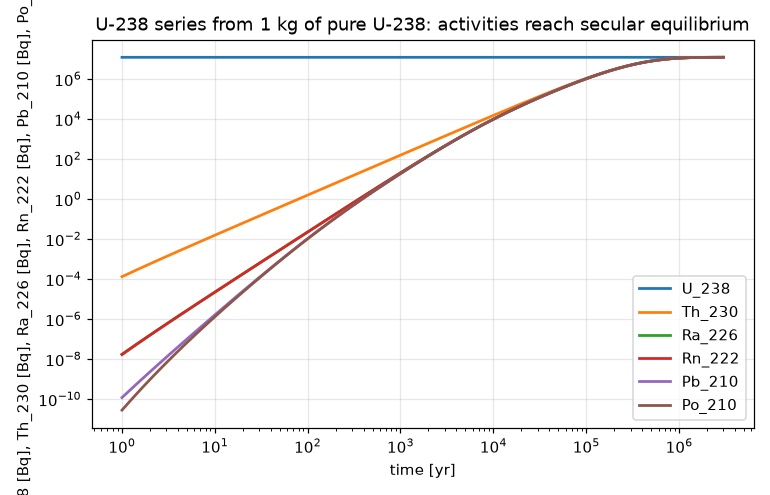

# The U-238 decay series: Bateman equations and secular equilibrium

**Physics.** Uranium-238 decays through 14 radioactive daughters to stable Pb-206. For a chain started from pure
parent, the numbers of atoms obey the Bateman equations (H. Bateman, *Proc. Cambridge Phil. Soc.* **15**, 423 (1910))

dN₁/dt = −λ₁N₁,   dN_i/dt = λ_(i−1) N_(i−1) − λ_i N_i,

whose closed-form solution is N_n(t) = N₁(0) (∏_(i<n) λ_i) Σ_j e^(−λ_j t) / ∏_(k≠j)(λ_k − λ_j). When the parent lives
much longer than every daughter, after a few daughter lifetimes all activities become equal: **secular equilibrium**,
A_i = λ_i N_i = λ₁ N₁. The half-lives here span 164 μs (Po-214) to 4.47×10⁹ yr (U-238), a ratio of 10²⁰, the textbook
example of a stiff system.

**Data.** Half-lives from NNDC NuDat: U-238 4.468×10⁹ yr, Th-234 24.10 d, Pa-234m 1.159 min, U-234 2.455×10⁵ yr,
Th-230 7.538×10⁴ yr, Ra-226 1600 yr, Rn-222 3.8235 d, Po-218 3.098 min, Pb-214 26.8 min, Bi-214 19.9 min,
Po-214 164.3 μs, Pb-210 22.20 yr, Bi-210 5.012 d, Po-210 138.376 d. The small branches (Bi-214 → Tl-210, 0.02 %;
Po-218 → At-218, 0.02 %; Bi-210 → Tl-206, 10⁻⁴ %) are left out: they end in the same members and don't change
the equilibrium activities by more than 0.02 %.

**Code.** [`u238_chain.fm`](u238_chain.fm) writes the 15 equations as they are written on paper and solves them
`using radau` for 1 kg of pure U-238, over 3 million years in ~9 000 steps. It then solves two small problems with
`until`: when a freshly sealed radium source's radon reaches 99 % of equilibrium, and when Th-234 grows back into
freshly purified uranium. Run it from this folder with `fermium run u238_chain.fm` (12 s).

## Results

Activity relative to U-238, from pure U-238 at t = 0 (Fermium; the closed-form Bateman solution computed with 60-digit
arithmetic in `tests/test_research.py` agrees to all printed digits):

| t | Th-234 | U-234 | Th-230 | Ra-226 | Rn-222 | Po-214 | Po-210 |
|---|---|---|---|---|---|---|---|
| 1 yr | 0.99997 | 2.5546×10⁻⁶ | 1.0745×10⁻¹¹ | 1.4313×10⁻¹⁵ | 1.3633×10⁻¹⁵ | 1.3627×10⁻¹⁵ | 2.2839×10⁻¹⁸ |
| 10³ yr | 1.0000 | 0.0028192 | 1.2927×10⁻⁵ | 1.6823×10⁻⁶ | 1.6822×10⁻⁶ | 1.6822×10⁻⁶ | 1.5327×10⁻⁶ |
| 10⁵ yr | 1.0000 | 0.24599 | 0.088545 | 0.085238 | 0.085238 | 0.085238 | 0.085192 |
| 3×10⁶ yr | 1.0000 | 0.99985 | 0.99977 | 0.99977 | 0.99977 | 0.99977 | 0.99977 |

| quantity | Fermium | analytic / published |
|---|---|---|
| secular equilibrium at 3 Myr: largest \|A_i/A_U − 1\| | 2.3×10⁻⁴ (the U-234/Th-230 lag) | Bateman: 2.3×10⁻⁴; all activities equal in equilibrium |
| specific activity of U-238 | 1.244×10⁷ Bq/kg | 12.4 kBq/g (standard value) |
| Rn-222 at 99 % of Ra-226 activity (sealed source) | **25.399 d** | 25.399 d (two-member Bateman); ≈ 6.64 Rn half-lives = 25.40 d |
| Th-234 at 99 % of U-238 activity (purified uranium) | **160.12 d** | 160.12 d (Bateman); 6.64 × 24.10 d |
| atoms conserved, total/N₀ − 1 | 6×10⁻¹⁴ | 0 |

- The approach to equilibrium is limited by the long-lived intermediates U-234 and Th-230: after 10⁵ yr the radium
  group is only at 8.5 % of equilibrium; after 3 Myr all members are within 2.3×10⁻⁴ of the U-238 activity, as the
  secular-equilibrium statement says.
- The "until" results are the standard radon-in-growth rule: wait ~25 days (about a month) after sealing a Ra-226
  source before counting its progeny.

## What writing it in Fermium showed
- The Bateman system reads like the textbook, and `using radau` handled a stiffness ratio of 10²⁰ in 9 000 steps
  with atoms conserved to 10⁻¹³. `until λ_Rn222 Rn = 0.99 λ_Ra226 Ra` states the question directly.
- **Bug found: interpolating a stiff solution between steps.** Reading the 3-Myr solution at t = 10⁵ yr, `Po214(1e5 yr)`,
  gave A(Po-214)/A(U-238) = 0.085379 instead of 0.085238 (0.17 % off), while the values *at* the solver's steps
  are right to 6 digits. The steps there are ~1 400 yr long and the interpolation is a cubic Hermite built from the
  derivatives at the step ends; for a component in quasi-equilibrium with a 164 μs lifetime, its derivative is a
  tiny difference of two large terms, dominated by the solver's error, and multiplying it by a 1 400-yr step ruins
  the interpolant. Radau has its own collocation polynomial (SciPy's dense output) that would not have this problem.
  The program works around it by solving up to each time T and reading `X[end]`.
- **Bug found: `tolerance` and `using` can't be combined.** `for t from 0 s to 1 s tolerance 1e-11 using radau`
  fails with "using isn't defined" (the parser reads `1e-11 using` as a product), although docs/reference.md §10
  gives the order `[tolerance r] [using method]`; `using radau tolerance 1e-11` is also refused. So a radau solve
  can't have its tolerance changed.
- A `plot` statement can't continue onto a line that starts with `with` ("this line is indented but isn't inside a
  block"), although continuing after a comma works.
- Plotting `λ values(N) vs times(N)` labels the axes with the expressions and in 1/s rather than Bq; named lists and
  `in Bq` fix it. With six series, the y-axis label (all six names joined) runs off the figure.
- A solution can't be kept past a loop, so the table loop also does the equilibrium check and the plot at its last
  iteration, inside an `if`.
