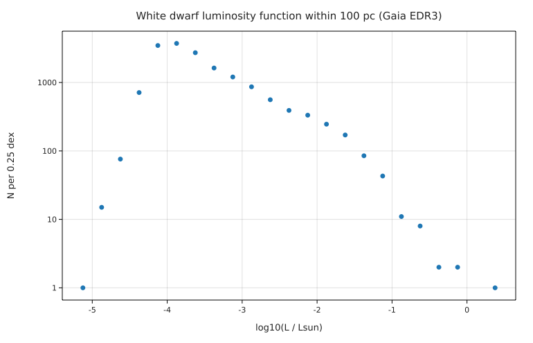
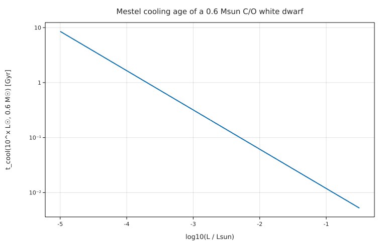

# White dwarf cooling ages: Mestel's theory against the Gaia 100 pc white dwarfs

**Physics.** A white dwarf has no nuclear energy left; it shines by radiating the heat of its ions. Mestel (1952) modelled
it as an isothermal, degenerate carbon–oxygen core under a thin radiative envelope with Kramers opacity
κ = κ₀ρT^(−3.5). Hydrostatic and radiative equilibrium in the envelope give P² ∝ (M/L) T^8.5, and the envelope ends where
the electrons become degenerate (ideal-gas pressure = degenerate pressure), so L = C M T_c^3.5. The ions' heat
U = (3/2) k_B T_c M/(A m_u) then runs out on the time scale

t_cool = (2/5) U/L ∝ M^(5/7) L^(−5/7).

With a constant birth rate the number of white dwarfs per unit log L is ∝ t_cool, a power law of slope −5/7, and the
luminosity function stops where the oldest white dwarfs are: its cut-off measures the age of the Galactic disk
(Winget et al. 1987: 9.3 ± 2.0 Gyr).

**Data.** The Gaia EDR3 white-dwarf catalogue (Gentile Fusillo et al. 2021), queried from VizieR's TAP service for all
high-probability white dwarfs within 100 pc (see [SOURCE.md](SOURCE.md)): 16 281 with hydrogen-atmosphere T_eff, log g and mass.

**Code.** [`wd_cooling.fm`](wd_cooling.fm) gets R = √(GM/g) and L = 4πR²σT⁴ for each star, derives Mestel's L(T_c) with units
from the envelope integral and the degeneracy condition (`ρ_env(T, Lum, Mass)`, `ρ_deg(T)`, parameters: helium envelope
μ = 4/3, Z = 0.02, X = 0; C/O core μ_e = 2, A = 14), inverts it with `solve` inside `t_cool(Lum, Mass)`, bins the luminosity
function, fits its slope and finds its cut-off. Run it from this folder with `fermium run wd_cooling.fm` (2.3 s).

## Results

| quantity | Fermium | published / expected | source |
|---|---|---|---|
| t(10⁻⁴ L☉)/t(10⁻³ L☉) | 5.179 | 10^(5/7) = 5.179 | Mestel 1952 |
| core temperature, 0.6 M☉ at 10⁻³ L☉ | 9.05 × 10⁶ K | ~10⁷ K (textbook order of magnitude) | |
| Mestel cooling age, 0.6 M☉ | 0.012, 0.062, 0.32, 1.65, **3.76 Gyr** at log L/L☉ = −1, −2, −3, −4, −4.5 | | |
| median mass | 0.631 M☉ | ≈ 0.6 M☉ | |
| luminosity-function slope, −3.25 < log L < −1.25 | **−0.606 ± 0.036** | −5/7 = −0.714 (Mestel, constant birth rate) | |
| peak of the luminosity function | log L/L☉ = −3.88 | | |
| faint-end cut-off (below 1/10 of the peak) | log L/L☉ = **−4.50** | ≈ −4.5 | Winget et al. 1987 (from Liebert, Dahn & Monet's luminosity function) |
| Mestel age at the cut-off | **3.76 Gyr** | disk age **9.3 ± 2.0 Gyr** | Winget et al. 1987 |

**Honest reading.** Gaia's 100 pc sample shows the two features Mestel's theory predicts: a power-law luminosity function
(slope −0.61, against −0.71; the birth rate was not constant, and at the bright end neutrino cooling steepens it), and a sharp
cut-off at log L/L☉ = −4.5, where Winget et al. put it with far fewer stars. But Mestel's simple cooling law gives an age of
only 3.8 Gyr at the cut-off, 2.5 times younger than Winget's 9.3 Gyr. The simple model leaves out what the full cooling
models include: the latent heat and phase separation released when the core crystallises, the coupling of the core to a
convective envelope (which changes L(T_c)), and a hydrogen/helium layer structure; all of them slow the cooling of old white
dwarfs. The ages also depend on the envelope parameters chosen here, as t ∝ (Z(1 + X))^(2/7) μ^(−8/7) (from C ∝ μ⁴/κ₀). So the reproduction confirms the
law's shape and the cut-off's position, and shows, honestly, that Mestel alone underestimates the disk age.
Hydrogen-atmosphere fits are used for all stars (the helium-atmosphere ones get somewhat wrong T and g), and the counts are
not corrected for incompleteness near 100 pc at the faint end.

## Friction
- A volume `V` clashed with the unit volt in `0.25 V` (clear error; renamed `V_100`).
- Masses loaded from a `[Msun]` column print as `Msun`, masses written `0.6 M☉` print as `M☉`.
- (Not friction:) `solve … for Tc2` inside a function worked, so the cooling age `t_cool(Lum, Mass)` could invert L(T_c) at every call.
